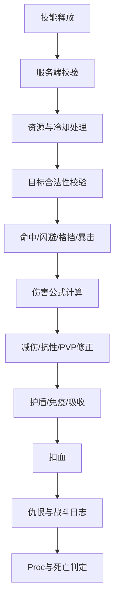

[任务规划完成]
# MMORPG GAS 系统补充完善

## 一、属性系统补充

### 属性成长体系
- 升级属性点分配（自由分配 vs 固定成长曲线）
- 属性成长公式的数值策划可配置性
- 属性软上限/硬上限设计（防止数值膨胀）
- 属性重置/洗点系统的实现
- 潜力值/觉醒属性等特殊成长维度

### 战斗属性细化
- 命中/闪避/格挡的概率计算链
- 穿透与抗性的对抗关系（物理穿透、魔法穿透）
- 暴击伤害倍率与暴击抗性的对抗
- 韧性/硬直值系统（被打断的阈值）
- 吸血/反伤/护盾量的属性化
- 速度类属性（攻速、施法速度、移速）对技能的影响方式

### 属性面板显示
- 面板值与实际计算值的差异处理（显示近似值）
- 属性变化的 UI 飘字与高亮提示
- 属性对比系统（换装前后对比）

---

## 二、技能系统补充

### 技能形态与变体
- 技能变体/进阶（同一技能的强化形态替换）
- 形态切换技能（变身、坐骑上下马改变技能栏）
- 武器切换联动技能栏变化
- 技能的多形态表现（同技能不同职业外观）

### 技能释放模式
- 指向性 / 方向性 / 范围指定 / 自动寻敌 的选择与混用
- 智能施法（Smart Cast）与确认施法的切换
- 技能的跟随目标 vs 落点固定的处理
- 技能弹道系统与 GAS 的对接边界

### 技能资源消耗
- 多资源类型（怒气、能量、连击点、灵魂值等）的 Attribute 建模
- 资源的自动回复规则（战斗中/战斗外差异）
- 资源不足时的技能反馈（UI 提示、音效、技能变灰）
- 资源消耗的预扣与回滚（预测场景）

### 技能冷却体系
- 分组冷却（同组技能共享 CD）
- 冷却缩减属性对 CD 的影响方式
- 冷却时间的网络同步精度问题
- 离线冷却恢复（下线后 CD 是否继续计时）
- 技能充能（Charge）机制的实现

### 连招与技能序列
- 连招判定窗口（时间窗口内按键触发下一段）
- 连招状态的 Tag 管理
- 连招被打断后的状态重置
- 自动连招 vs 手动连招的设计选择

---

## 三、Buff/Debuff 体系补充

### 常见状态效果实现
- **控制类**：眩晕/沉默/定身/恐惧/魅惑/嘲讽 的 Tag + BlockAbility 实现
- **增益类**：无敌/霸体（免控）/隐身/加速 的边界条件
- **持续伤害**：中毒/燃烧/流血 的 Periodic Effect 实现
- **护盾类**：伤害吸收盾、类型免疫盾、反伤盾的 Attribute 建模方式
- **标记类**：印记/标记（被动触发条件）的 Tag 实现

### Buff 叠加规则细化
- 同 Source 同 Effect 的叠加策略（刷新/叠层/独立）
- 不同 Source 同 Effect 的处理（多人点燃叠加问题）
- 叠层数作为 Magnitude 输入的实现方式
- 最大叠层限制与溢出处理

### 控制抵抗体系
- 控制免疫的实现（Tag 屏蔽 + Effect 免疫）
- 霸体层数（被控 N 次后才生效）
- 控制时间衰减（同类控制重复施加时间递减）
- 驱散系统的分类（友方驱散/自身驱散/类型限制）

---

## 四、伤害系统补充

### 伤害计算链
- 伤害类型分层（物理/魔法/真实/混合）
- 伤害计算的执行顺序（基础值→加成→减伤→吸收→最终）
- `ExecutionCalculation` vs `ModifierMagnitudeCalculation` 的使用边界
- 伤害来源快照（Snapshot）时机的正确性

### 伤害修正
- 距离衰减伤害的实现
- 背刺/侧击的方向性伤害加成
- 连击数/Combo 计数器影响伤害
- 技能等级对伤害公式的影响方式

### 伤害反馈
- 伤害数字飘字的类型区分（暴击/普通/吸收/免疫）
- 受击硬直与 GAS 的联动
- 死亡判定与死亡 Effect 的触发时机
- 濒死状态（血量低于阈值触发特殊 Tag）

---

## 五、天赋/被动系统

- 天赋树节点作为 Ability 授予的实现
- 被动技能对主动技能的修改方式（`GameplayAbilitySpec` 动态修改）
- 天赋点数作为 Attribute 管理
- 天赋的互斥节点（选 A 则 B 不可选）用 Tag 实现
- 天赋重置对已授予 Ability 的清理流程

---

## 六、装备系统与 GAS 的对接

- 装备属性通过 `Infinite GE` 应用与移除
- 装备特效技能的授予与撤销时机
- 套装效果（N 件套激活额外 Effect）的触发条件
- 装备耐久度影响属性的实现
- 宝石/附魔作为动态 Modifier 的管理

---

## 七、职业/转职系统

- 职业基础属性差异的初始化方式
- 转职时技能集的替换流程（旧技能撤销 + 新技能授予）
- 多职业/副职业的 ASC 技能共存管理
- 职业专属 Tag 对通用技能行为的影响

---

## 八、任务/成就与 GAS 联动

- 击杀/技能使用次数统计通过 `GameplayEvent` 上报
- 任务条件触发技能解锁
- 成就达成授予永久 Buff（Infinite GE）
- 称号系统作为属性加成的 GE 管理

---

## 九、PVP 专项

- PVP/PVE 伤害公式的动态切换（Tag 区分场景）
- 反外挂：服务器二次校验技能合法性
- 技能 CD 的防篡改校验
- 竞技场属性压缩（统一属性上限）的实现
- 观战模式下 ASC 数据的只读同步

---

## 十、性能与优化

- 大量 NPC 使用简化 ASC 或自定义轻量替代方案
- Effect 预测的批量处理
- `GameplayCue` 的距离裁剪与 LOD
- 属性变化的脏标记批量更新（避免每帧广播）
- ASC 在不可见/休眠 Actor 上的 Tick 优化


---
---


[任务规划完成]
你这份前期清单已经覆盖得**相当完整**，尤其是属性、技能、Buff、伤害、装备、PVP、性能这些 GAS 核心域都考虑到了。

如果从 MMORPG + UE GAS 的角度看，主要还可以补充这些方向：

- **GAS 架构边界**
- **服务器权威与预测策略**
- **数据驱动与数值策划工作流**
- **目标选择、仇恨、队伍/副本机制**
- **职业循环与资源循环**
- **技能编辑器/调试工具**
- **Buff 分类、驱散、免疫、快照、可见性**
- **MMORPG 常见战斗机制：打断、读条、引导、公共 CD、仇恨、仇恨转移、团本机制**
- **持久化：离线 CD、Buff 下线保留、装备 GE 重建、技能栏保存**
- **反作弊与服务端二次校验**

下面我按模块帮你补充。

---

## 一、整体 GAS 架构层面的补充

### 1. ASC 放置位置

MMORPG 里通常建议：

- **玩家角色 ASC 放在 `PlayerState`**
  - 角色死亡、切图、换身体、坐骑、变身时 ASC 不丢失。
  - 更适合持久化属性、Buff、技能 CD。
- **怪物/NPC ASC 放在 `Character` 或专用 CombatComponent**
  - 大量 NPC 可以使用简化版 ASC 或非 GAS 轻量战斗组件。
- **召唤物/宠物**
  - 需要明确是：
    - 独立 ASC
    - 继承主人属性的快照
    - 实时共享主人部分 Attribute
    - 只接收主人 Buff 的子集

### 2. AttributeSet 拆分

建议不要把所有属性塞到一个 AttributeSet。可以拆成：

- **基础属性**
  - 力量、敏捷、智力、体质、精神
- **战斗属性**
  - 攻击、防御、命中、闪避、暴击、韧性、穿透、抗性
- **资源属性**
  - 生命、法力、怒气、能量、连击点、护盾
- **移动/动作属性**
  - 移速、攻速、施法速度、冷却缩减
- **PVP 专用属性**
  - PVP 减伤、PVP 增伤、控制减免、竞技场压缩系数
- **职业专属属性**
  - 圣能、符文、剑意、灵力、热量、弹药等

这样后续职业扩展会轻松很多。

### 3. GameplayTag 体系规划

你已经提到了很多 Tag，但建议前期就设计 Tag 命名规范。

例如：

```text
State.Control.Stun
State.Control.Silence
State.Control.Root
State.Control.Fear
State.Immune.Control
State.Immune.Damage.Physical
State.Buff.Invisible
State.Buff.SuperArmor

Ability.Attack.Basic
Ability.Skill.Fireball
Ability.Skill.Charge
Ability.Passive.CritBonus

Cooldown.Global
Cooldown.Skill.Fireball
Cooldown.Group.Movement

Damage.Physical
Damage.Magical.Fire
Damage.Magical.Ice
Damage.True

Combat.PVP
Combat.PVE
Combat.Boss
Combat.Elite

Resource.Mana
Resource.Rage
Resource.ComboPoint
```

重点是：

- **状态类 Tag**
- **技能类 Tag**
- **冷却类 Tag**
- **伤害类型 Tag**
- **控制类型 Tag**
- **免疫类型 Tag**
- **职业/武器/形态 Tag**
- **场景 Tag，例如 PVP/PVE/副本/战场**
- **机制 Tag，例如不可驱散、Boss 免疫、团队机制**

Tag 体系越早规划，后面返工越少。

---

## 二、数据驱动与策划配置补充

你已经考虑了数值策划可配置性，但 MMORPG 项目里建议更进一步。

### 1. 技能表与 GE 表分离

常见配置可以拆成：

- **技能基础表**
  - 技能 ID、名称、图标、职业、等级、释放类型、目标类型
- **技能数值表**
  - 每级基础伤害、系数、消耗、CD、范围、弹道速度
- **技能表现表**
  - 动画、特效、音效、镜头震动、GameplayCue
- **Buff 表**
  - 持续时间、叠层、驱散类型、显示优先级
- **伤害公式表**
  - 技能系数、属性引用、PVE/PVP 修正
- **AI 使用技能表**
  - 怪物释放条件、权重、距离、冷却、阶段

不要把所有东西硬编码到 Ability C++ / 蓝图里。

### 2. 技能版本与热更新

MMORPG 很常见：

- 线上平衡性调整
- 技能系数热修
- Buff 持续时间热修
- 装备特效热修
- 职业调整

建议前期预留：

- **技能配置版本号**
- **服务端权威配置**
- **客户端表现配置**
- **数值回滚能力**
- **战斗日志可追溯：本次伤害用了哪个配置版本**

---

## 三、属性系统遗漏补充

你列的属性系统已经很细了，可以再补这些。

### 1. 属性来源追踪

MMORPG 里属性通常来自很多地方：

- 角色基础成长
- 等级成长
- 装备
- 宝石
- 附魔
- 套装
- 称号
- 坐骑
- 宠物
- 公会科技
- 食物 Buff
- 药剂 Buff
- 地图区域 Buff
- 团队 Buff
- 临时活动 Buff
- PVP 压缩 Buff

建议每个属性来源都能追踪：

- 来源类型
- 来源 ID
- 是否可驱散
- 是否参与面板显示
- 是否参与 PVP 压缩
- 是否持久化
- 是否下线计时

否则后期查数值会很痛苦。

### 2. 属性快照与实时引用

需要提前明确哪些属性：

- **释放时快照**
  - DOT 伤害
  - 召唤物属性
  - 陷阱伤害
  - 延迟爆炸伤害
- **命中时实时读取**
  - 即时伤害
  - 命中判定
  - 护盾吸收
- **周期性重新计算**
  - 光环
  - 地面持续区域
  - 引导技能

例如：

```text
释放火球时快照法术强度？
还是命中目标时读取法术强度？
点燃 DOT 是释放时锁定伤害，还是每跳动态计算？
```

这会直接影响职业平衡。

### 3. 属性显示分层

建议 UI 面板区分：

- **基础值**
- **装备加成**
- **Buff 加成**
- **临时加成**
- **PVP 修正后实际值**
- **副本压缩后实际值**

比如玩家看到攻击力 10000，但进竞技场实际压缩成 5000，需要 UI 能解释。

---

## 四、技能系统补充

你现在的技能系统已经包含变体、释放、资源、冷却、连招。MMORPG 里还建议补充这些。

---

### 1. 公共冷却 GCD

大多数 MMORPG 都有 **Global Cooldown**。

需要考虑：

- 哪些技能触发 GCD
- 哪些技能不触发 GCD
  - 瞬发保命
  - 打断
  - 位移
  - 饰品
- GCD 是否受急速/施法速度影响
- GCD 最小值限制
- GCD 和技能自身 CD 如何显示
- GCD 是否参与预测

可以用 `Cooldown.Global` Tag 做公共 CD。

---

### 2. 读条技能

你目前提到了施法速度，但还可以细化读条系统。

需要考虑：

- 读条开始
- 读条中移动是否打断
- 读条中受到伤害是否打断
- 读条可否被沉默/打断技能打断
- 读条结束时是否再次校验目标合法
- 读条期间目标死亡怎么办
- 读条期间目标出距离/出视线怎么办
- 读条完成瞬间目标无敌怎么办
- 读条是否可被急速缩短
- 读条取消是否返还资源/CD

常见技能类型：

- **Cast**
  - 火球术，读完才生效
- **Channel**
  - 奥术飞弹，读条期间周期生效
- **Charge Up**
  - 蓄力技能，时间越久效果越强
- **Hold Release**
  - 按住蓄力，松手释放

---

### 3. 引导技能 Channel

引导技能比普通读条复杂。

需要考虑：

- 每跳结算一次伤害还是最后一次结算
- 引导期间是否锁定朝向
- 引导期间是否可以移动
- 引导期间是否持续消耗资源
- 目标脱离范围是否停止
- 目标死亡后是否自动切换目标
- 引导被打断时是否触发部分效果
- 引导技能是否能被加速缩短间隔

GAS 上可以用：

- Ability Task
- Periodic GameplayEffect
- GameplayEvent
- GameplayCue 持续表现
- Channeling Tag

---

### 4. 技能打断系统

MMORPG 里非常重要，尤其 PVP 和 Boss 战。

建议设计：

- **可打断技能**
- **不可打断技能**
- **Boss 技能只允许特定机制打断**
- **打断成功后的锁系机制**
  - 打断火系技能后，火系技能 N 秒不可用
- **假读条骗打断**
- **免打断状态**
- **打断免疫递减**
- **队友打断共享 DR**

Tag 示例：

```text
State.Casting
State.Channeling
State.InterruptImmune

Ability.School.Fire
Ability.School.Ice
Ability.School.Holy

Cooldown.Lockout.Fire
```

---

### 5. 技能目标合法性校验

你已经考虑指向性/方向性/范围指定，但 MMORPG 需要更完整的目标校验。

包括：

- 是否敌对
- 是否友方
- 是否自己
- 是否死亡
- 是否无敌
- 是否隐身
- 是否可被选择
- 是否在安全区
- 是否在 PVP 状态
- 是否同阵营
- 是否同队/团队
- 是否有视线 Line of Sight
- 是否在距离内
- 是否在角度内
- 是否在高度差范围内
- 是否在地形可达区域
- 是否处于技能免疫状态
- 是否 Boss 机制允许

建议统一做 Target Validation，不要每个技能各写一遍。

---

### 6. 技能命中与碰撞

MMORPG 技能不一定全是锁定技能。建议补充：

- 目标锁定技能
- 投射物技能
- 地面范围技能
- 锥形技能
- 矩形技能
- 链式弹跳技能
- 穿透技能
- 反弹技能
- 延迟爆炸技能
- 陷阱技能
- 图腾/召唤物技能
- 地面持续区域 AoE
- 跟随目标的 AoE
- 跟随施法者的 AoE
- 可被障碍物阻挡的弹道
- 不可阻挡的魔法弹道
- 可被格挡/闪避/反射/吸收的弹道

GAS 只负责能力逻辑和效果结算，复杂弹道最好由专门 Projectile/Targeting 系统处理，再把命中结果以 GameplayEvent/TargetData 传给 Ability。

---

### 7. 技能栏与输入系统

MMORPG 需要考虑：

- 技能拖拽到快捷栏
- 技能栏保存
- 多套技能栏
- PVP/PVE 技能栏不同
- 坐骑技能栏
- 载具技能栏
- 变身技能栏
- 宠物技能栏
- 宏命令
- 自动攻击开关
- 队友目标快捷键
- 焦点目标 Focus Target
- 鼠标悬停目标 Mouseover Cast
- 对目标的目标释放 Target of Target
- 技能队列 Spell Queue

**技能队列** 很重要，例如玩家在 GCD 结束前 0.2 秒按下技能，服务器可以缓存并在 GCD 结束后释放。

---

### 8. 自动攻击系统

很多 MMORPG 有普攻循环，不只是技能。

需要考虑：

- 自动攻击开启/关闭
- 近战自动攻击距离
- 远程自动攻击弹药/弹道
- 攻速影响攻击间隔
- 切换目标是否保持自动攻击
- 技能释放是否重置普攻计时
- 普攻是否触发被动、吸血、暴击、命中
- 双持武器主副手攻击
- 普攻与 GCD 的关系

---

### 9. 职业循环设计

除了单个技能，还要考虑职业整体战斗循环：

- 资源获取技能
- 资源消耗技能
- 爆发窗口技能
- 填充技能
- 斩杀技能
- 保命技能
- 位移技能
- 控制技能
- 打断技能
- 团队辅助技能
- 长 CD 大招
- 被动触发技能
- 随机 Proc 技能

例如：

```text
战士：怒气生成 → 怒气消耗 → 斩杀阶段 → 爆发窗口
法师：读条输出 → 瞬发触发 → 爆发冷却 → 控制保命
刺客：连击点生成 → 终结技消耗 → 背刺/潜行强化
牧师：治疗资源 → HOT 维护 → 爆发治疗 → 驱散
```

---

## 五、常见 MMORPG 技能类型补充

你可以把技能按类型先整理成模板，后续每个职业组合这些模板。

### 1. 输出类技能

- **单体直伤**
  - 火球、斩击、射击
- **范围直伤**
  - 暴风雪、旋风斩、地震
- **DOT**
  - 中毒、燃烧、流血、诅咒
- **延迟伤害**
  - 炸弹、印记爆炸
- **斩杀技能**
  - 目标血量低于一定比例时伤害提高
- **背刺技能**
  - 从背后攻击增伤或必暴
- **蓄力技能**
  - 蓄力越久伤害越高
- **连锁技能**
  - 闪电链、弹射箭
- **穿透技能**
  - 一条直线打多个目标
- **分裂技能**
  - 命中后分裂到周围敌人
- **召唤物伤害**
  - 图腾、宠物、机关炮台

### 2. 治疗类技能

- **单体治疗**
- **群体治疗**
- **持续治疗 HOT**
- **护盾治疗**
- **吸血治疗**
- **智能治疗**
  - 自动选择血量最低目标
- **链式治疗**
- **治疗增效 Buff**
- **预读治疗**
- **救急治疗**
  - 目标低血量时治疗量增加
- **复活技能**
- **战斗复活**
- **治疗转伤害/伤害转治疗**

### 3. 防御类技能

- **减伤**
- **免伤**
- **护盾**
- **格挡强化**
- **招架强化**
- **闪避强化**
- **反伤**
- **伤害转移**
  - 坦克替队友承伤
- **嘲讽**
- **群体嘲讽**
- **仇恨提升**
- **仇恨复制**
- **濒死保护**
  - 受到致死伤害时保留 1 点生命
- **无敌**
- **霸体**
- **免控**

### 4. 控制类技能

- **眩晕**
- **沉默**
- **定身**
- **减速**
- **恐惧**
- **魅惑**
- **嘲讽**
- **击退**
- **击飞**
- **拉拽**
- **缴械**
- **变形**
- **睡眠**
- **冰冻**
- **致盲**
- **禁疗**
- **封锁位移**
- **强制移动**
- **定向转身**
- **打断施法**
- **技能锁系**

### 5. 位移类技能

- **冲锋**
- **闪现**
- **后跳**
- **翻滚**
- **钩锁**
- **突进到目标背后**
- **交换位置**
- **拉队友**
- **推敌人**
- **传送到召唤物**
- **坐骑冲刺**
- **短暂无敌位移**
- **位移后强化下一击**

### 6. 辅助类技能

- **团队增伤**
- **团队减伤**
- **加速**
- **法力回复**
- **资源回复**
- **复活**
- **驱散**
- **净化**
- **隐身**
- **反隐**
- **侦测陷阱**
- **召唤队友**
- **传送门**
- **战斗旗帜**
- **团队护盾**
- **伤害分摊**

### 7. 机制类技能

- **标记目标**
- **引爆标记**
- **复制 Buff**
- **偷取 Buff**
- **转移 Debuff**
- **延长 Buff**
- **缩短 Debuff**
- **技能重置**
- **CD 返还**
- **资源返还**
- **技能替换**
- **下一次技能强化**
- **技能二段释放**
- **条件触发技能**
- **处决技能**
- **变身技能**
- **召唤领域**
- **场地机制交互**

---

## 六、Buff / Debuff 体系补充

你列的 Buff 体系很完整，可以再加这些 MMORPG 常见细节。

---

### 1. Buff 可见性与显示优先级

Buff 不只是生效，还要考虑 UI 显示。

建议每个 Buff 配置：

- 是否显示给自己
- 是否显示给队友
- 是否显示给敌人
- 是否显示给观察者
- 是否显示剩余时间
- 是否显示叠层
- 是否显示来源
- 是否可点击取消
- 是否可被插件/战斗日志读取
- 显示优先级
- 是否 Boss 机制高亮
- 是否团队框架显示

例如：

```text
普通食物 Buff：低优先级
Boss 点名 Debuff：最高优先级
治疗 HOT：队伍框架显示
敌方爆发 Buff：PVP 中需要显示
隐身 Buff：敌人不可见
```

---

### 2. Buff 分类

建议前期分类：

- **Magic 魔法**
- **Curse 诅咒**
- **Poison 毒**
- **Disease 疾病**
- **Bleed 流血**
- **Physical 物理**
- **Enrage 激怒**
- **Aura 光环**
- **Food 食物**
- **Potion 药剂**
- **Mount 坐骑**
- **Title 称号**
- **Zone 区域**
- **BossMechanic Boss 机制**
- **Undispellable 不可驱散**

这会影响驱散、免疫、职业特色。

---

### 3. 驱散和净化规则

建议设计：

- 友方驱散 Debuff
- 敌方驱散 Buff
- 自身净化
- 群体驱散
- 随机驱散 N 个
- 指定类型驱散
- 优先驱散高优先级
- 驱散成功触发惩罚
  - 例如驱散爆炸、沉默驱散者
- 不可驱散
- Boss 机制不可驱散
- 驱散抵抗
- 驱散 CD
- 驱散保护 Buff

---

### 4. Buff 来源与归属

尤其 DOT、HOT、光环、伤害统计时很重要。

需要记录：

- 施法者
- 原始施法者
- 当前拥有者
- 技能 ID
- 装备 ID
- 召唤物 ID
- 伤害归属玩家
- 队伍/团队归属
- 是否算击杀贡献
- 是否算任务进度
- 是否算仇恨

例如宠物打死怪，任务击杀算给主人。

---

### 5. 光环 Aura 系统

MMORPG 很常见，但你清单里还没单独列。

光环类型：

- 以自己为中心的团队 Buff
- 以目标为中心的 Debuff 光环
- 图腾光环
- 地面区域光环
- 队伍全局光环
- 公会/阵营光环
- Boss 阶段光环

需要考虑：

- 进入范围应用 GE
- 离开范围移除 GE
- 死亡是否移除
- 下线是否移除
- 同类光环是否取最高值
- 多个来源是否叠加
- 周期扫描性能
- 队伍/团队过滤
- 是否穿墙
- 是否受高度差影响

---

### 6. 触发型 Buff / Proc

这类非常常见，建议提前设计触发系统。

触发条件：

- 命中时
- 暴击时
- 闪避时
- 格挡时
- 受到伤害时
- 击杀时
- 治疗时
- 释放某类技能时
- 消耗资源时
- 血量低于阈值时
- 进入战斗时
- 离开战斗时
- 周期触发
- 队友死亡时
- 目标被控制时

触发限制：

- 内置 CD
- 每分钟触发次数 PPM
- 概率触发
- 保底触发
- 只触发一次
- 每个目标独立 CD
- 全局触发 CD

---

### 7. Buff 快照问题

DOT/HOT 特别需要注意。

例如：

```text
我开爆发 Buff 后给目标上燃烧。
爆发 Buff 结束后，燃烧后续跳数是否继续享受爆发加成？
```

常见方案：

- **完全快照**
  - 释放时锁定全部属性
- **动态计算**
  - 每跳读取当前属性
- **部分快照**
  - 快照攻击力，但动态读取目标减伤
- **刷新继承**
  - 刷新 DOT 时是否重算快照
- **叠层独立快照**
  - 每层来源和数值不同

这一定要在数值规则里统一。

---

## 七、伤害系统补充

你已经有计算链，可以补充几个 MMORPG 关键点。

---

### 1. 战斗事件流水线

建议把一次伤害抽象成流水线：

```text
技能请求
→ 服务端合法性校验
→ 消耗资源/CD
→ 目标选择
→ 命中判定
→ 暴击/格挡/闪避/招架
→ 伤害类型修正
→ 攻击方增伤
→ 防御方减伤
→ PVP/PVE 修正
→ 护盾吸收
→ 免疫/无敌判断
→ 最终生命扣减
→ 仇恨计算
→ 触发 Proc
→ 战斗日志
→ 飘字/音效/特效
→ 死亡判定
```

可以用类似下面的逻辑图管理：



---

### 2. 命中结果类型

建议不只是普通/暴击，还要细化：

- Hit 命中
- Miss 未命中
- Dodge 闪避
- Parry 招架
- Block 格挡
- Resist 抵抗
- Immune 免疫
- Absorb 吸收
- Reflect 反射
- Deflect 偏斜
- Crit 暴击
- Crushing 碾压
- Glancing 擦伤
- Overkill 溢出击杀
- Execute 斩杀

这些会影响战斗日志、飘字、触发被动。

---

### 3. 仇恨系统

MMORPG 非常关键，你目前清单里没有单独列。

需要设计：

- 伤害产生仇恨
- 治疗产生仇恨
- 嘲讽设置最高仇恨
- 强制攻击某目标
- 仇恨衰减
- 仇恨转移
- 仇恨清除
- 隐身/假死清仇恨
- 宠物仇恨归属
- 坦克姿态仇恨倍率
- 副本 Boss 仇恨锁定
- 多目标仇恨表
- 仇恨 UI
- 脱战重置

仇恨通常不建议直接做成 Attribute，而是单独 Combat/Aggro 系统，但可以通过 GameplayEvent 和 GE 结果联动。

---

### 4. 战斗状态

建议补充：

- 进入战斗
- 脱离战斗
- 战斗中禁止换装
- 战斗中禁止切天赋
- 战斗中禁止坐骑
- 战斗中资源回复规则改变
- 战斗中不能传送
- 战斗状态影响怪物重置
- 战斗状态影响副本 Boss 封锁

可以使用：

```text
State.Combat.InCombat
State.Combat.OutOfCombat
```

---

### 5. 死亡与复活流程

你提到了死亡 Effect，但 MMORPG 里死亡流程比较复杂。

需要考虑：

- 玩家死亡
- 怪物死亡
- 假死
- 濒死
- 倒地
- 战斗复活
- 普通复活
- 灵魂状态
- 跑尸
- 墓地复活
- 副本内复活限制
- PVP 复活点
- 死亡是否清 Buff
- 死亡是否清 Debuff
- 死亡是否清仇恨
- 死亡是否保留宠物
- 死亡时技能是否全部取消
- 死亡后 ASC 是否还同步
- 死亡掉落/耐久损失

---

## 八、团队、副本、Boss 机制补充

这是 MMORPG 和普通 ARPG 最大的差异之一。

### 1. 队伍/团队系统与 GAS

需要考虑：

- 队伍 Buff
- 团队 Buff
- 小队光环
- 治疗目标过滤
- 智能治疗优先队友
- 团队框架 Buff/Debuff 显示
- 队长/团长机制
- 标记目标
- 团队职责：坦克/治疗/DPS
- 跨队伍 Buff 是否生效
- 副本内团队限制

---

### 2. Boss 机制

建议单独设计 Boss Ability 模板。

常见机制：

- 阶段切换
- 血量阈值技能
- 时间轴技能
- 点名
- 分摊伤害
- 分散站位
- 连线
- 躲圈
- 地板技能
- 场地安全区
- 召唤小怪
- 软狂暴
- 硬狂暴
- 仇恨换坦
- 坦克易伤叠层
- 驱散惩罚
- 打断轮换
- 治疗吸收盾
- 反伤阶段
- 免疫阶段
- 护盾破除
- 机制失败团灭
- 战斗复活次数限制

这些很多都可以用 GameplayTag + GE + Ability + GameplayEvent 实现。

---

### 3. 副本状态

需要考虑：

- 副本进度
- Boss 击杀状态
- 战斗锁门
- 死亡复活点
- 掉落归属
- 每日/每周 CD
- 副本难度修正
- 普通/英雄/史诗难度技能变化
- 小怪是否重生
- 副本内 Buff
- 退出副本后 Buff 是否保留

---

## 九、宠物、召唤物、随从系统

你的清单里还没有明显覆盖宠物/召唤物，这是 MMORPG 常见模块。

### 1. 宠物属性

需要考虑：

- 宠物独立 AttributeSet
- 宠物继承主人百分比属性
- 宠物实时继承还是召唤时快照
- 宠物继承主人暴击/急速/穿透
- 宠物继承主人 PVP 修正
- 宠物死亡与复活
- 宠物治疗
- 宠物 Buff
- 宠物装备
- 宠物技能栏

### 2. 召唤物类型

- 战斗宠物
- 临时召唤物
- 图腾
- 炮台
- 镜像
- 分身
- 陷阱
- 地面领域
- 护卫 NPC
- 坐骑
- 载具

### 3. 归属与仇恨

需要明确：

- 召唤物伤害算谁的
- 召唤物击杀是否算任务
- 召唤物是否产生独立仇恨
- 召唤物死亡是否触发主人被动
- 主人死亡后召唤物是否消失
- 主人下线后召唤物是否消失

---

## 十、装备系统补充

你已经考虑装备 GE、套装、耐久、宝石附魔。可以补充这些。

### 1. 装备换装限制

MMORPG 通常需要：

- 战斗中不能换装备
- PVP 中不能换装备
- 副本战斗中不能换天赋/装备
- 武器可以战斗中切换但触发 CD
- 换装备后属性重算
- 换装备后技能授予/撤销
- 换装备后 Buff 是否移除
- 装备触发特效内置 CD 是否保留

---

### 2. 装备特效类型

常见装备特效：

- 装备后固定属性
- 使用后主动技能
- 命中时触发
- 暴击时触发
- 受伤时触发
- 治疗时触发
- 血量低时触发
- 杀敌后触发
- 套装 N 件触发
- 职业专属加成
- 修改某技能效果
- 改变资源机制
- 降低技能 CD
- 使技能获得额外充能
- 技能命中后叠层
- 叠满触发爆发

这些都需要和 GAS 的 Ability 授予、GE、Tag、GameplayEvent 结合。

---

### 3. 装备随机词条

MMORPG 常见装备会有随机词条，需要考虑：

- 随机属性生成
- 词条等级
- 词条权重
- 词条范围
- 词条锁定
- 词条重铸
- 词条洗练
- 稀有词条
- 传奇特效
- 装备评分
- 属性预算系统

如果有随机词条，不建议每个词条都做一个 GE 类，最好用动态 GE Spec + SetByCaller 或自定义数据驱动方案。

---

## 十一、天赋/被动系统补充

你已经列了天赋树和被动修改主动技能。可以补充：

### 1. 被动修改技能的方式

常见方式有：

- 修改技能数值
- 修改技能 CD
- 修改技能消耗
- 修改技能范围
- 修改技能目标数量
- 修改技能伤害类型
- 增加额外效果
- 替换技能
- 技能二段化
- 技能变成瞬发
- 技能获得充能
- 技能命中后返还资源
- 技能暴击后重置 CD

在 GAS 里建议通过：

- GameplayTag 条件分支
- Ability 内读取天赋 Tag
- GE 修改 Attribute
- SetByCaller 参数
- 授予替代 Ability
- AbilitySet 重建
- 自定义技能配置合并

### 2. 构筑 Build 系统

MMORPG 后期通常需要：

- 多套天赋页
- PVE/PVP 不同构筑
- 快速切换构筑
- 构筑导入/导出
- 构筑保存到服务器
- 切换构筑时技能栏自动适配
- 切换构筑时非法技能自动移除

---

## 十二、任务、成就、称号补充

你已经提到了任务联动 GAS，可以补充：

### 1. 任务条件类型

- 击杀指定怪物
- 对指定目标使用技能
- 被指定技能命中
- 承受/造成某类伤害
- 治疗队友
- 打断 Boss 技能
- 驱散指定 Debuff
- 保持 Buff N 秒
- 在指定状态下击杀
- 使用职业技能完成目标
- PVP 击杀
- 连杀
- 协助击杀
- 副本机制成功处理

这些都适合通过 GameplayEvent 上报，但不要让任务系统强依赖 GAS 内部类。

---

### 2. 成就与称号属性

称号系统建议明确：

- 称号是否只能装备一个
- 称号属性是否永久生效
- 装备称号才生效还是获得即生效
- 称号是否参与 PVP
- 称号属性是否可叠加
- 成就是否给永久 GE
- 永久 GE 是否登录时重建

---

## 十三、PVP 补充

你已有 PVP/PVE 公式、反作弊、压缩、观战。可以补充：

### 1. 控制递减 DR

PVP 很常见。

例如：

```text
第一次眩晕 100% 时长
第二次同类眩晕 50% 时长
第三次 25%
第四次免疫
一段时间后重置
```

需要考虑：

- 控制分类
- 同类递减
- 不同类是否共享递减
- Boss 是否免 DR
- PVE 是否启用 DR
- DR 状态是否显示
- DR 是否可被驱散
- DR 是否随死亡清除

---

### 2. PVP 模板化数值

建议分离：

- PVE 技能系数
- PVP 技能系数
- PVP 治疗修正
- PVP 护盾修正
- PVP 控制时长修正
- PVP 装备压缩
- PVP 等级同步
- PVP 禁用某些装备特效
- PVP 禁用某些药剂/食物 Buff

否则 PVP 平衡会被 PVE 数值拖垮。

---

### 3. 安全区与阵营

需要考虑：

- 安全区禁止攻击
- 决斗状态
- 战场状态
- 竞技场状态
- 野外 PVP 开关
- 红名/犯罪状态
- 阵营敌对
- 公会宣战
- 同队友方保护
- 误伤规则
- 友方技能是否可对敌方释放

---

## 十四、AI 与怪物技能系统

你的清单里偏玩家系统，MMORPG 还需要怪物/AI 使用技能。

### 1. 怪物技能释放规则

- 距离条件
- 血量条件
- 仇恨目标条件
- 阶段条件
- 冷却条件
- 目标数量条件
- 随机权重
- 固定时间轴
- 被打断后备用技能
- 技能失败后重试
- Boss 狂暴技能

### 2. 怪物属性模板

- 普通怪
- 精英怪
- 稀有怪
- 世界 Boss
- 副本 Boss
- 召唤物
- 守卫 NPC
- 中立 NPC

需要考虑：

- 等级缩放
- 副本人数缩放
- 难度缩放
- 区域缩放
- 世界等级缩放

---

## 十五、网络、预测与服务器权威

GAS 用在 MMORPG 时，这块非常关键。

### 1. 哪些东西允许客户端预测

适合预测：

- 本地技能按键反馈
- 技能前摇动画
- 技能图标变灰
- 短位移开始
- 资源预扣显示
- 普通技能 CD 表现
- GameplayCue 本地预播放

不适合完全信任客户端：

- 命中结果
- 暴击结果
- 伤害数值
- 掉落
- 经验
- 任务进度
- PVP 控制成功
- 目标是否合法
- 位置是否有效
- 技能是否真的可释放

### 2. 服务器二次校验

每次技能释放建议校验：

- 技能是否已学习
- 技能是否在当前技能栏/形态可用
- 是否有足够资源
- 是否冷却完成
- 是否满足武器要求
- 是否满足状态要求
- 是否被沉默/眩晕/缴械
- 是否在距离内
- 是否有视线
- 是否目标合法
- 是否当前场景允许
- 是否移动速度异常
- 是否施法时间足够
- 是否客户端时间戳异常

---

## 十六、持久化补充

MMORPG 和单机/联机动作游戏最大的差别之一是持久化。

### 1. 不建议直接持久化 GAS 运行态

建议持久化：

- 等级
- 经验
- 属性点分配
- 技能学习状态
- 技能等级
- 天赋配置
- 装备
- 宝石/附魔
- 称号
- 坐骑
- 宠物
- 长期 Buff ID
- CD 到期时间戳
- 技能栏配置

登录时根据这些数据**重建 ASC 状态**。

### 2. Buff 下线处理

每个 Buff 应该配置：

- 下线后是否保留
- 下线后是否继续计时
- 下线后是否暂停计时
- 死亡是否移除
- 进副本是否移除
- 进 PVP 是否移除
- 登出是否移除
- 是否跨地图保留
- 是否可被 GM 清除

### 3. CD 持久化

需要区分：

- 普通技能 CD
- 大招 CD
- 物品使用 CD
- 副本锁定 CD
- 世界 Boss 参与 CD
- 战斗复活 CD
- 炉石/传送 CD

一般存**服务器绝对时间戳**，而不是剩余秒数。

---

## 十七、性能与可扩展性补充

你已经有性能考虑，可以补充这些。

### 1. 大规模战斗优化

MMORPG 常见问题：

- 同屏大量玩家
- 大量 Buff
- 大量 DOT/HOT Tick
- 大量 GameplayCue
- 大量属性变更广播
- 大量宠物/召唤物
- 大量 AoE 查询
- 大量战斗日志

建议：

- DOT/HOT Tick 合批
- 低优先级 Buff 降低同步频率
- 远距离玩家不显示详细飘字
- GameplayCue LOD
- 非目标玩家只同步必要状态
- 大规模战场使用简化命中/伤害表现
- 怪物不一定全用完整 ASC
- 属性 UI 脏标记批量刷新
- Buff UI 批量刷新
- AoE 查询做空间分区优化
- 周期性光环不要每帧扫描

---

### 2. Replication 策略

需要提前决定：

- 自己看到完整属性
- 队友看到部分属性
- 敌人看到有限属性
- 观察者看到只读属性
- 远距离玩家只同步关键状态
- 隐身玩家不向敌方同步可见信息
- Boss 机制 Debuff 强制同步
- 战斗日志是否全量同步

---

## 十八、调试、日志与工具链

这个很容易遗漏，但 MMORPG 后期非常重要。

### 1. 战斗日志

建议从第一天就设计战斗日志格式。

记录：

- 时间戳
- 攻击者
- 目标
- 技能 ID
- GE ID
- 伤害类型
- 基础伤害
- 暴击/命中结果
- 增伤来源
- 减伤来源
- 护盾吸收
- 最终伤害
- 仇恨变化
- Buff 叠层变化
- 配置版本号

这对数值排查和反外挂非常关键。

### 2. GM/调试命令

建议预留：

- 添加 Buff
- 移除 Buff
- 清空 CD
- 学习技能
- 修改属性
- 打印 ASC 状态
- 打印当前 GE
- 打印当前 Tags
- 打印技能 CD
- 打印伤害公式过程
- 模拟 PVP/PVE 场景
- 开启无敌
- 强制触发 Proc
- 生成测试怪

### 3. 技能测试场景

建议做一个内部测试地图：

- 木桩
- 多目标木桩
- 移动木桩
- PVP 假人
- Boss 假人
- 护盾假人
- 高抗性假人
- 控制免疫假人
- 可打断读条假人
- 多人压力测试假人

---

## 十九、建议你额外加入的顶层模块清单

你现在有十个大模块，我建议补成这些：

### 11. GAS 架构与 Tag 规范

- ASC 放置位置
- AttributeSet 拆分
- GameplayTag 命名规范
- GameplayEffect 分类规范
- GameplayCue 规范
- AbilitySet 授予/撤销流程
- 预测策略
- 服务端权威边界

### 12. 目标选择与命中系统

- 目标合法性
- 距离/视线/角度
- 锁定目标
- 焦点目标
- 鼠标悬停目标
- 智能目标
- AoE 目标过滤
- 弹道命中
- 地形遮挡

### 13. 读条、引导与打断系统

- Cast
- Channel
- Charge
- Hold Release
- Interrupt
- Lockout
- 移动打断
- 受击打断
- 免打断

### 14. 仇恨与战斗状态系统

- 仇恨表
- 嘲讽
- 治疗仇恨
- 宠物仇恨
- 脱战
- 怪物重置
- 战斗中限制

### 15. 队伍、团队与副本机制

- 队伍 Buff
- 团队框架
- Boss 阶段
- 点名/分摊/分散
- 副本进度
- 副本难度
- 战斗复活限制

### 16. 宠物、召唤物与图腾

- 属性继承
- 伤害归属
- 技能栏
- 仇恨归属
- 生命周期
- Buff 继承

### 17. 持久化与在线状态

- 技能栏保存
- Buff 下线规则
- CD 时间戳
- 装备 GE 重建
- 天赋 Build 保存
- 登录重建 ASC

### 18. 调试、日志与数值工具

- 战斗日志
- GM 命令
- 技能测试场
- 公式回放
- 配置版本追踪

---

## 二十、最值得优先定下来的设计决策

如果你现在处于前期规划阶段，我建议优先确定这些，因为后面改动成本最大：

- **ASC 放在哪里**
  - 玩家推荐 `PlayerState`，怪物按复杂度决定。
- **GameplayTag 命名规范**
  - 状态、技能、冷却、伤害、免疫、场景必须统一。
- **属性来源追踪**
  - 后期查数值、做 PVP 压缩、装备对比都依赖它。
- **伤害计算链**
  - 顺序一旦确定，所有技能都应遵守。
- **Buff 叠加与快照规则**
  - DOT/HOT/爆发窗口/PVP 平衡都依赖它。
- **技能目标校验规则**
  - 服务端权威、反作弊、PVP 都依赖它。
- **技能数据驱动格式**
  - 不然后期每加技能都要写大量重复逻辑。
- **持久化边界**
  - GAS 运行态不要直接当存档，建议登录时重建。
- **PVE/PVP 公式分离**
  - MMORPG 非常建议从一开始就分开。
- **战斗日志格式**
  - 没日志，后面调数值和查外挂会非常痛苦。

---

## 简短结论

- **你当前清单已经覆盖了 GAS 战斗系统的大部分核心点。**
- 主要遗漏在 MMORPG 特有的几个方向：
  - **仇恨系统**
  - **读条/引导/打断/锁系**
  - **GCD 与技能队列**
  - **队伍/团队/Boss 机制**
  - **宠物/召唤物/图腾**
  - **Buff 可见性、驱散分类、快照规则**
  - **目标合法性与服务器校验**
  - **持久化与登录重建 ASC**
  - **战斗日志、GM 工具、数值调试工具**
- 如果你要用 UE GAS 做 MMORPG，建议前期不要只设计 Ability 和 GE，还要同步设计：
  - **Tag 规范**
  - **AttributeSet 拆分**
  - **数据表结构**
  - **服务端权威校验**
  - **战斗日志**
  - **持久化重建流程**