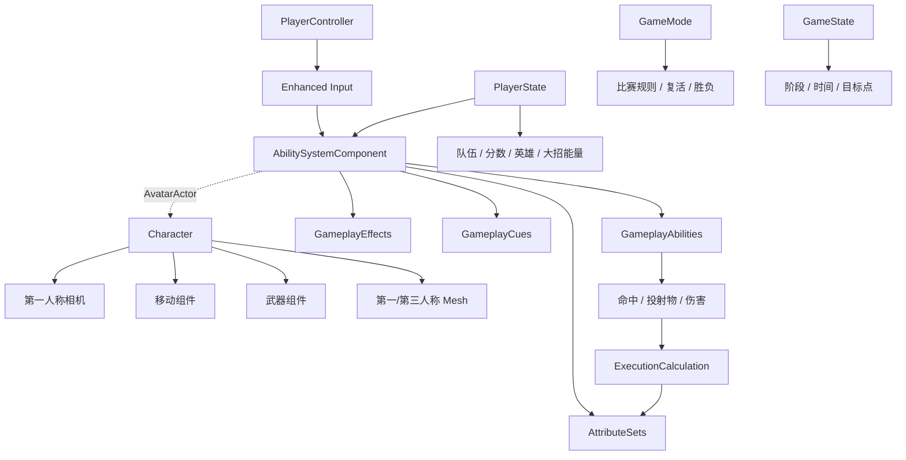
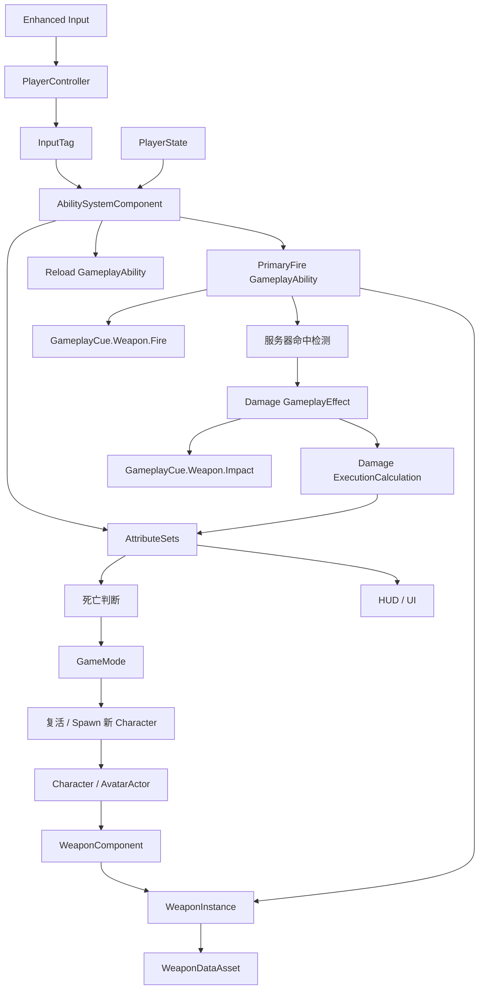
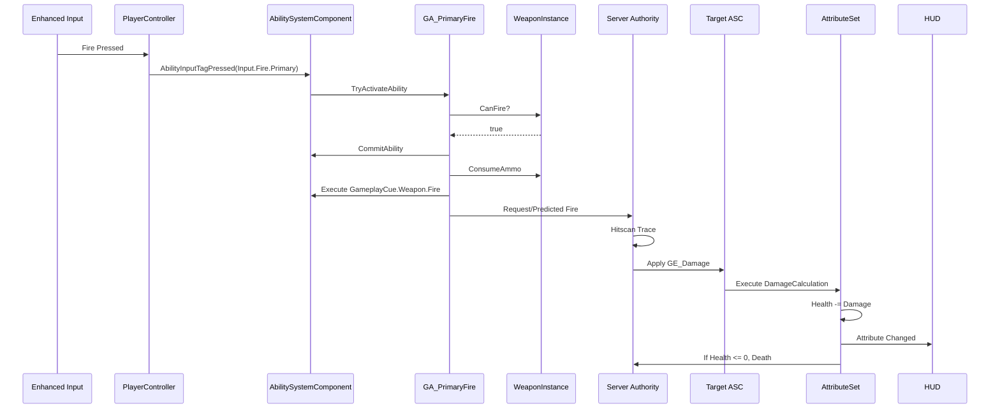
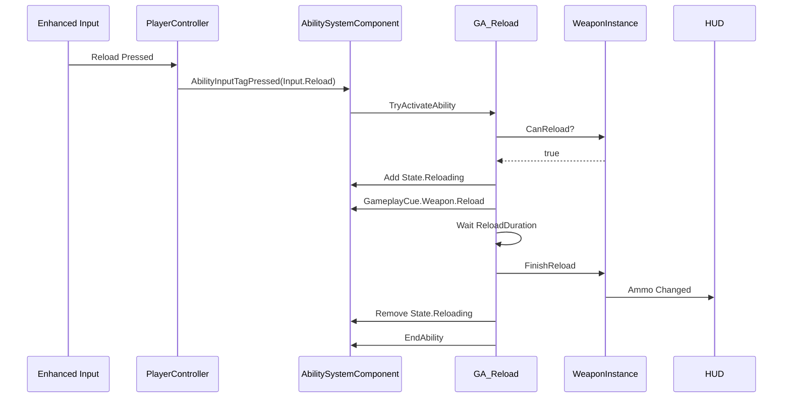
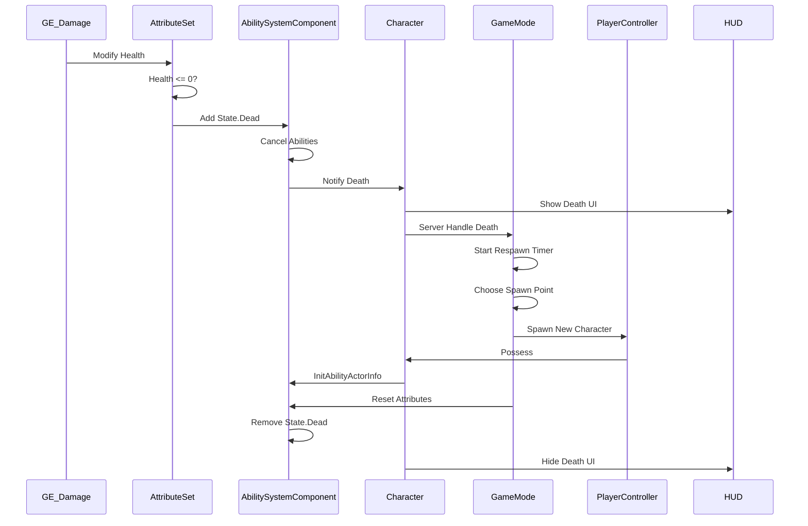

[任务规划完成]
<thinking>**Analyzing character systems**

I'm considering how characters can be structured, especially in an Overwatch-like game. A good idea could be to have a `PlayerState` that holds an `AbilitySystemComponent`. This way, the character would manage movement, collision, and the camera, while the actual avatar could be a hero pawn. It helps to streamline functionality and might increase the game’s performance as I keep things organized. I need to think more about how these elements interact in practice.</thinking>
如果你要用 **UE5 + GAS** 做类似守望先锋的第一人称英雄射击游戏，前期最重要的不是马上写技能，而是先确定：**多人网络模型、角色/技能架构、武器架构、伤害流程、数据驱动方式、GAS 的所有权和复制策略**。这些一旦后期推倒会非常痛。

下面按优先级整理。

---

## 一、前期必须先确定的核心问题

### 1. 游戏类型边界

你要先明确项目到底是哪种 FPS：

- **纯 FPS 射击**：枪械、命中、换弹、后坐力是核心。
- **英雄 FPS**：每个英雄有独立技能、被动、终极技能、资源系统。
- **类守望先锋**：通常还包括：
  - 英雄切换
  - 队伍阵营
  - 复活/回合/占点/推车
  - 技能冷却
  - 大招能量
  - 状态效果
  - 护盾/护甲/生命值
  - 位移技能
  - 服务器权威多人同步

如果是类守望先锋，建议从一开始就按 **多人英雄 FPS** 架构设计，而不是先做单机 FPS 再改多人。

---

## 二、网络架构必须早定

### 1. 服务器权威

射击游戏建议采用：

- **服务器权威**
  - 客户端负责输入、表现、预测。
  - 服务器负责最终判定：命中、伤害、死亡、技能生效。
- **客户端预测**
  - 移动、部分技能释放、开火反馈需要预测。
- **服务器回滚/延迟补偿**
  - FPS 命中判定后期非常关键。
  - 如果是 hitscan 武器，最好早期就预留延迟补偿架构。

不要让客户端直接决定伤害，否则很难防作弊。

---

### 2. Dedicated Server 还是 Listen Server

前期要确定：

- **正式多人竞技**：推荐 Dedicated Server。
- **本地联机/测试**：可以先 Listen Server。
- **类守望先锋**：最终基本应按 Dedicated Server 设计。

架构上不要依赖本地玩家逻辑，否则后期迁移 Dedicated Server 会很痛。

---

### 3. 网络同步对象划分

常见划分：

- `GameMode`
  - 只在服务器存在。
  - 控制比赛规则、胜负、出生、复活。
- `GameState`
  - 所有人同步。
  - 控制比分、阶段、倒计时、目标点状态。
- `PlayerController`
  - 玩家输入、UI、客户端 RPC。
- `PlayerState`
  - 玩家长期状态。
  - 队伍、分数、英雄选择、GAS 推荐放这里。
- `Character`
  - 当前出生的角色实体。
  - 移动、胶囊体、Mesh、武器挂点、相机。
- `AbilitySystemComponent`
  - GAS 核心组件。
  - 类守望先锋项目推荐放在 `PlayerState`。

---

## 三、GAS 架构必须早定

### 1. `AbilitySystemComponent` 放在哪里

这是 GAS 项目最重要的早期决策之一。

#### 方案 A：放在 `Character`

适合：

- 单机游戏
- 角色不会频繁死亡/重生
- 不需要英雄切换
- 不需要玩家状态跨 Pawn 保留

缺点：

- 死亡、重生、换英雄时 `ASC` 生命周期复杂。
- 大招能量、玩家属性、冷却等容易丢失或迁移麻烦。

---

#### 方案 B：放在 `PlayerState`

适合：

- 多人游戏
- 英雄 FPS
- 需要重生
- 需要换英雄
- 需要大招能量保留或部分保留
- 需要玩家状态独立于当前角色

**类守望先锋项目推荐这个方案。**

推荐结构：

```text
PlayerState
 ├─ AbilitySystemComponent
 ├─ AttributeSets
 ├─ TeamId
 ├─ HeroId
 ├─ Score
 └─ UltimateCharge

Character
 ├─ Movement
 ├─ Mesh
 ├─ Camera
 ├─ Weapon
 └─ AvatarActor for ASC
```

也就是说：

- `PlayerState` 是 GAS 的 Owner Actor。
- `Character` 是 GAS 的 Avatar Actor。
- 玩家死亡后换一个新的 `Character`，但 `ASC` 仍然在 `PlayerState` 上。

---

### 2. GAS 初始化流程

早期必须统一初始化流程，否则后期会出现大量技能失效、属性不同步、客户端拿不到 ASC 的问题。

推荐流程：

```text
PlayerController Possess Character
        ↓
PlayerState 拥有 ASC
        ↓
Character 调用 InitAbilityActorInfo
        ↓
赋予英雄 AbilitySet
        ↓
初始化 AttributeSet
        ↓
绑定输入
        ↓
刷新 UI
```

需要特别注意：

- 服务端和客户端都要正确初始化 `AbilityActorInfo`。
- `PossessedBy` 和 `OnRep_PlayerState` 都要处理初始化。
- UI 不要直接假设 `ASC` 一定立刻有效。

---

### 3. GAS 复制模式

多人项目需要考虑 `ASC` 的复制模式：

- `Full`
  - 所有 GameplayEffect 都复制。
  - 适合单机或低人数。
- `Mixed`
  - Owner 获得完整信息，其他客户端只获得必要信息。
  - 多人英雄 FPS 推荐。
- `Minimal`
  - 更省带宽，但信息少。
  - 适合 AI 或大量单位。

类守望先锋项目通常推荐：

```cpp
ASC->SetReplicationMode(EGameplayEffectReplicationMode::Mixed);
```

前提是 Owner 链路正确，比如 `PlayerState`、`PlayerController`、`Character` 的所有权关系要清晰。

---

## 四、GameplayTag 体系必须早设计

GAS 项目非常依赖 `GameplayTag`。前期不规划，后期会变成灾难。

建议从一开始建立统一命名规范。

### 1. 技能标签

示例：

```text
Ability.Hero.Tracer.Blink
Ability.Hero.Tracer.Recall
Ability.Hero.Reinhardt.Charge
Ability.Weapon.PrimaryFire
Ability.Weapon.Reload
```

### 2. 状态标签

```text
State.Dead
State.Stunned
State.Silenced
State.Rooted
State.Invulnerable
State.Aiming
State.Reloading
State.Sprinting
```

### 3. 输入标签

```text
Input.Move
Input.Look
Input.Jump
Input.Fire.Primary
Input.Fire.Secondary
Input.Ability.Skill1
Input.Ability.Skill2
Input.Ability.Ultimate
Input.Reload
```

### 4. 伤害类型标签

```text
Damage.Bullet
Damage.Explosive
Damage.Melee
Damage.Fire
Damage.Electric
Damage.TrueDamage
```

### 5. 资源标签

```text
Resource.Health
Resource.Armor
Resource.Shield
Resource.Ammo
Resource.UltimateCharge
```

**建议所有技能、状态、输入、伤害、资源都用 GameplayTag 表达，不要用大量枚举硬编码。**

---

## 五、属性系统架构

类守望先锋项目建议至少拆这些 `AttributeSet`。

### 1. 生存属性

```text
Health
MaxHealth
Armor
MaxArmor
Shield
MaxShield
ShieldRegenRate
```

注意守望先锋式伤害通常不是简单扣血，而是可能按顺序处理：

```text
护盾 → 护甲 → 生命值
```

也可能有：

- 护盾自动恢复
- 护甲减伤
- 临时护盾
- 过量治疗
- 无敌状态

这些要提前考虑。

---

### 2. 移动属性

```text
MoveSpeed
SprintSpeed
JumpPower
GravityScale
AirControl
```

很多英雄技能会修改移动能力，比如加速、减速、击退、冲锋、飞行。

---

### 3. 战斗属性

```text
Damage
FireRate
ReloadSpeed
Spread
Recoil
CriticalMultiplier
CooldownReduction
```

武器和技能都可能修改这些属性。

---

### 4. 资源属性

```text
Ammo
MaxAmmo
UltimateCharge
MaxUltimateCharge
Energy
```

大招能量建议一开始就作为明确系统设计。

---

## 六、技能架构

### 1. 技能不要直接写死在角色里

错误做法：

```text
TracerCharacter 里面直接写 Blink、Recall、Ultimate
```

推荐做法：

```text
HeroData
 ├─ AbilitySet
 ├─ AttributeInitData
 ├─ WeaponData
 ├─ Mesh
 ├─ AnimBP
 └─ UIData
```

角色只是承载体，英雄数据决定技能和表现。

---

### 2. 使用 AbilitySet 管理技能

建议设计类似：

```text
HeroAbilitySet
 ├─ GameplayAbilities
 ├─ GameplayEffects
 ├─ AttributeSets
 └─ InputTag Mapping
```

例如：

```text
TracerAbilitySet
 ├─ PrimaryFire
 ├─ Blink
 ├─ Recall
 ├─ PulseBomb
 └─ Passive
```

这样换英雄时只需要：

```text
移除旧 AbilitySet
应用新 AbilitySet
初始化属性
刷新武器和 UI
```

---

### 3. 技能类型分类

建议前期按行为分类：

- **主动技能**
  - 冲刺、传送、护盾、治疗、投掷物。
- **被动技能**
  - 二段跳、自动回血、护甲增强。
- **武器技能**
  - 主武器开火、副武器开火、换弹、瞄准。
- **大招技能**
  - 需要资源，通常有特殊 UI 和广播。
- **状态技能**
  - 眩晕、沉默、减速、禁疗、无敌。

---

### 4. 技能释放流程

建议统一为：

```text
输入
 ↓
InputTag
 ↓
激活 GameplayAbility
 ↓
检查 Cost / Cooldown / 状态标签
 ↓
播放预测表现
 ↓
服务器确认
 ↓
生成 TargetData
 ↓
应用 GameplayEffect
 ↓
同步 GameplayCue
```

不要每个技能各写一套释放逻辑。

---

## 七、武器系统架构

类守望先锋的武器不要简单做成普通枪械系统，因为不同英雄差异很大。

### 1. 武器需要支持多种模式

至少考虑：

- Hitscan
  - 士兵 76、黑百合类型。
- Projectile
  - 法老之鹰火箭、半藏箭矢类型。
- Beam
  - 查莉娅、莫伊拉类型。
- Melee
  - 莱因哈特锤子类型。
- Area Effect
  - 榴弹、炸弹、范围治疗。
- Lock-on / Assist
  - 自动锁定或辅助瞄准类技能。

---

### 2. 开火也建议做成 GameplayAbility

推荐：

```text
PrimaryFireAbility
SecondaryFireAbility
ReloadAbility
MeleeAbility
```

优点：

- 能直接使用 GAS 的冷却、消耗、标签阻塞。
- 可以统一处理沉默、眩晕、换弹、弹药。
- 能支持预测和服务器校验。

---

### 3. 命中判定架构

需要提前决定：

#### Hitscan

```text
客户端立即表现
服务器验证射线
延迟补偿
应用伤害
```

#### Projectile

```text
服务器生成投射物
客户端预测表现
投射物碰撞
应用伤害
```

#### Beam

```text
持续检测目标
周期性 GameplayEffect
同步特效
```

---

## 八、伤害系统架构

伤害不要直接写成：

```cpp
TargetHealth -= Damage;
```

推荐走 GAS：

```text
GameplayEffect
 ↓
ExecutionCalculation
 ↓
Damage Context
 ↓
护盾/护甲/生命处理
 ↓
死亡判断
 ↓
击杀归属
```

### 1. 伤害上下文需要包含

建议设计自定义 `GameplayEffectContext`，至少携带：

```text
Instigator
Causer
Weapon
Ability
HitResult
DamageType
IsCritical
Headshot
SourceLocation
TargetLocation
```

否则后面做击杀回放、爆头、助攻、伤害来源 UI 会很麻烦。

---

### 2. 伤害流程建议

```text
攻击方 Ability
 ↓
构造 Damage GameplayEffectSpec
 ↓
写入伤害数值、伤害类型、命中信息
 ↓
目标 ASC 接收
 ↓
ExecutionCalculation 计算最终伤害
 ↓
修改 Health / Armor / Shield
 ↓
如果死亡，通知 GameMode / PlayerState
```

---

## 九、输入架构

UE5 推荐使用 Enhanced Input。

建议结构：

```text
Enhanced Input Action
 ↓
InputTag
 ↓
ASC 激活对应 Ability
```

不要在 `PlayerController` 里直接写：

```text
按 Q 调用 Ultimate()
按 E 调用 Skill1()
```

而是做成数据驱动映射：

```text
Input.Fire.Primary → Ability.Weapon.PrimaryFire
Input.Ability.Skill1 → Ability.Hero.Skill1
Input.Ability.Ultimate → Ability.Hero.Ultimate
```

这样换英雄、换平台、改键都会简单很多。

---

## 十、角色与英雄架构

### 推荐分层

```text
BaseCharacter
 ├─ 移动
 ├─ 相机
 ├─ Mesh
 ├─ ASC Avatar 初始化
 ├─ 死亡/复活表现
 └─ 通用交互

HeroData
 ├─ 英雄名称
 ├─ AbilitySet
 ├─ Attribute 初始化
 ├─ 武器数据
 ├─ 动画数据
 ├─ UI 图标
 └─ 音效/特效

PlayerState
 ├─ ASC
 ├─ 当前英雄
 ├─ 队伍
 ├─ 分数
 └─ 大招能量
```

### 不建议

不要为每个英雄都创建完全独立的一整套角色逻辑，例如：

```text
TracerCharacter
ReinhardtCharacter
MercyCharacter
GenjiCharacter
```

可以有特殊子类，但不要把通用系统散落在每个英雄里。

---

## 十一、动画架构

FPS 英雄射击通常需要两套表现：

- **第一人称表现**
  - 手臂、武器、开火、换弹、技能动画。
- **第三人称表现**
  - 其他玩家看到的全身动画。
- **服务器逻辑**
  - 不应该依赖动画完成来决定关键结果。

推荐：

```text
GameplayAbility 控制逻辑
GameplayCue 控制特效/音效
AnimMontage 控制动画表现
AnimNotify 只做辅助，不做核心判定
```

不要让核心伤害完全依赖动画通知，否则网络同步会很难控制。

---

## 十二、GameplayCue 架构

GAS 中特效、音效、震动、UI 提示建议使用 `GameplayCue`。

例如：

```text
GameplayCue.Weapon.Fire
GameplayCue.Weapon.Impact.Flesh
GameplayCue.Weapon.Impact.Wall
GameplayCue.Ability.Blink
GameplayCue.Ability.Heal
GameplayCue.Status.Stunned
```

好处：

- 逻辑和表现分离。
- 网络同步方便。
- 技能表现可以由数据驱动。

---

## 十三、游戏模式架构

类守望先锋不要只设计角色和技能，还要早考虑比赛系统。

### 需要预留

- 队伍系统
- 出生点系统
- 复活时间
- 英雄选择
- 比赛阶段
  - 等待
  - 选人
  - 准备
  - 战斗
  - 加时
  - 结算
- 目标点
- 推车
- 占点
- 胜负条件
- 计分板
- 击杀信息
- 回放/最佳镜头，如果有需求

推荐：

```text
GameMode
 ├─ Match Flow
 ├─ Spawn Logic
 ├─ Win Condition
 └─ Server Authority Rules

GameState
 ├─ Match Phase
 ├─ Timer
 ├─ Objective State
 ├─ Team Score
 └─ Replicated Match Data
```

---

## 十四、数据驱动架构

前期一定要避免大量硬编码。

建议用：

- `PrimaryDataAsset`
- `DataTable`
- `GameplayTag`
- `CurveTable`
- `ScalableFloat`

### 推荐数据资产

```text
HeroDataAsset
WeaponDataAsset
AbilitySetDataAsset
DamageTypeDataAsset
GameModeDataAsset
InputConfigDataAsset
```

例如一个英雄数据可以包含：

```text
HeroId
DisplayName
Role
Mesh
AnimBlueprint
AbilitySet
WeaponData
BaseAttributes
Portrait
UltimateIcon
```

这样后期加英雄不需要改大量 C++。

---

## 十五、模块划分建议

如果项目会变大，建议一开始就按模块/插件思路组织。

### 可选架构

```text
Core
 ├─ 基础类型
 ├─ GameplayTags
 ├─ 日志
 └─ 通用工具

Ability
 ├─ ASC
 ├─ AttributeSet
 ├─ GameplayAbility
 ├─ GameplayEffect
 └─ GameplayCue

Combat
 ├─ 武器
 ├─ 投射物
 ├─ 命中判定
 ├─ 伤害计算
 └─ 延迟补偿

Character
 ├─ BaseCharacter
 ├─ Movement
 ├─ Camera
 └─ Hero Avatar

Game
 ├─ GameMode
 ├─ GameState
 ├─ PlayerState
 ├─ Team
 └─ Objective

UI
 ├─ HUD
 ├─ 英雄选择
 ├─ 技能冷却
 ├─ 血条
 └─ 击杀信息
```

如果是学习项目，可以不用拆太细；但逻辑边界要先想清楚。

---

## 十六、推荐总体架构图



---

## 十七、建议的基础类设计

### 1. 玩家状态

建议：

```text
HeroPlayerState
 ├─ AbilitySystemComponent
 ├─ AttributeSets
 ├─ TeamId
 ├─ CurrentHeroId
 ├─ UltimateCharge
 └─ Score Data
```

负责长期状态。

---

### 2. 角色

建议：

```text
HeroCharacter
 ├─ Camera
 ├─ FirstPersonMesh
 ├─ ThirdPersonMesh
 ├─ Movement
 ├─ WeaponComponent
 ├─ ASC Avatar Init
 └─ Death / Respawn Visual
```

负责当前实体表现。

---

### 3. 技能基类

建议：

```text
HeroGameplayAbility
 ├─ InputTag
 ├─ AbilityTags
 ├─ ActivationBlockedTags
 ├─ Cost
 ├─ Cooldown
 ├─ Prediction
 └─ Common Helper Functions
```

---

### 4. 武器

建议：

```text
WeaponInstance
 ├─ WeaponData
 ├─ Ammo
 ├─ FireMode
 ├─ Spread
 ├─ Recoil
 ├─ Reload
 └─ Fire Ability Binding
```

---

### 5. 英雄数据

建议：

```text
HeroDataAsset
 ├─ HeroTag
 ├─ HeroName
 ├─ Role
 ├─ AbilitySet
 ├─ WeaponData
 ├─ AttributeInitData
 ├─ MeshData
 ├─ AnimationData
 └─ UIData
```

---

## 十八、最容易踩坑的地方

### 1. `ASC` 放错位置

如果你未来有死亡、复活、换英雄，`ASC` 放在 `Character` 上会增加复杂度。类守望先锋推荐放 `PlayerState`。

---

### 2. 技能和角色强绑定

不要让技能逻辑写死在具体角色类里。否则英雄越多越难维护。

---

### 3. 伤害绕过 GAS

如果一开始直接改血量，后面做护甲、护盾、减伤、增伤、爆头、禁疗会很痛。

---

### 4. 不规划 GameplayTag

GAS 项目中 `GameplayTag` 是核心骨架。前期命名混乱，后期重构成本极高。

---

### 5. 忽略预测

FPS 手感强依赖即时反馈。开火、换弹、位移技能、命中反馈，都需要考虑客户端预测和服务器确认。

---

### 6. 用动画驱动核心逻辑

动画可以驱动表现，但核心判定应由 GameplayAbility 和服务器逻辑控制。

---

### 7. 太早做复杂英雄

建议先做一个“标准英雄”验证完整闭环：

```text
移动
开火
换弹
受伤
死亡
复活
一个小技能
一个大招
UI
多人同步
```

不要一开始就做十几个英雄。

---

## 十九、推荐开发顺序

### 第一阶段：核心 GAS 骨架

- `PlayerState` 持有 `ASC`
- `Character` 作为 Avatar
- 初始化属性
- 输入绑定 Ability
- 基础血量/死亡
- 基础 GameplayTag 体系

---

### 第二阶段：基础 FPS 闭环

- 第一人称相机
- 开火 Ability
- 命中检测
- 伤害 GameplayEffect
- 死亡/复活
- UI 显示血量和弹药

---

### 第三阶段：多人同步

- Dedicated Server 测试
- 客户端预测
- RPC 校验
- GameplayCue 同步
- PlayerState / GameState 同步

---

### 第四阶段：英雄系统

- `HeroDataAsset`
- `AbilitySet`
- 英雄选择
- 英雄切换
- 不同属性初始化
- 不同武器和技能

---

### 第五阶段：比赛系统

- 队伍
- 出生点
- 回合状态
- 计时器
- 目标点
- 胜负判断

---

### 第六阶段：高级体验

- 延迟补偿
- 命中反馈
- 击杀信息
- 大招语音/提示
- 观战
- 回放
- 平衡参数热更新

---

## 二十、我建议你的初始架构选择

如果目标明确是 **UE5 + GAS + 类守望先锋 FPS**，我建议：

- **`ASC` 放在 `PlayerState`**
- **`Character` 只作为当前英雄 Avatar**
- **技能、武器、英雄都数据驱动**
- **开火、换弹、技能全部走 `GameplayAbility`**
- **伤害全部走 `GameplayEffect` + `ExecutionCalculation`**
- **表现走 `GameplayCue`**
- **输入走 Enhanced Input + GameplayTag**
- **属性拆分为生存、移动、战斗、资源几个 `AttributeSet`**
- **从第一天就按服务器权威多人游戏设计**

最小闭环可以先做：

```text
一个英雄
一把 hitscan 武器
一个位移技能
一个大招
血量/死亡/复活
多人同步
基础 UI
```

不要一开始做太多英雄，先把架构跑通。

---

- **最关键的早期决策**：`ASC` 生命周期、网络权威模型、GameplayTag 规范、伤害管线、数据驱动方式。
- **最推荐的核心架构**：`PlayerState` 持有 `ASC`，`Character` 作为 Avatar，英雄通过 `HeroDataAsset + AbilitySet` 装配。
- **最优先验证的闭环**：输入 → Ability → 命中 → Damage GE → Attribute 修改 → 死亡/复活 → UI/特效同步。


---
---
# 接下来考虑
[任务规划完成]
我假设你说的“第一步”是前面提到的：

> **核心 GAS 骨架已经完成**：`PlayerState` 持有 `ASC`，`Character` 作为 Avatar，基础属性、输入、Ability、血量/死亡、GameplayTag 已经跑通。

那么下一步不要急着做复杂英雄，而是应该进入 **基础 FPS 战斗闭环阶段**。

---

## 下一步最应该考虑的方面

### 1. 先确认 GAS 骨架是否真的稳定

在继续做武器和技能之前，先确认这些点：

- **`ASC` 初始化是否完整**
  - 服务端 `PossessedBy` 是否初始化。
  - 客户端 `OnRep_PlayerState` 是否初始化。
  - `InitAbilityActorInfo` 是否在服务端和客户端都正确调用。
- **死亡/复活后是否还能正常使用 Ability**
  - 角色销毁后，`PlayerState` 上的 `ASC` 是否保留。
  - 新 `Character` 是否重新作为 Avatar 绑定。
- **输入和 Ability 是否解耦**
  - 输入最好走 `InputTag`。
  - 不要直接在角色里写死 `按 E 调用某技能`。
- **Attribute 是否正常复制到客户端**
  - 血量变化 UI 是否稳定刷新。
  - 客户端加入/重连后属性是否正确。

如果这一步没确认，后面做武器、技能、UI 时问题会成倍放大。

---

## 2. 做一个最小 FPS 战斗闭环

下一阶段目标不是做完整英雄，而是做一个最小可玩的闭环：

```text
输入开火
 ↓
激活开火 Ability
 ↓
消耗弹药 / 检查冷却
 ↓
客户端播放开火表现
 ↓
服务器做命中判定
 ↓
应用 Damage GameplayEffect
 ↓
目标扣血
 ↓
死亡
 ↓
复活
 ↓
继续战斗
```

这是整个项目的核心主干。

你应该优先做：

- **一把基础武器**
  - 可以先做 `Hitscan`。
  - 类似士兵 76 的普通步枪。
- **一个开火 Ability**
  - `PrimaryFireAbility`
- **一个换弹 Ability**
  - `ReloadAbility`
- **一个伤害 GameplayEffect**
- **一个伤害计算逻辑**
  - 后面再扩展护甲、护盾、爆头、减伤。
- **一个死亡/复活流程**

---

## 3. 武器系统架构要开始定型

这一步需要确定：你的武器到底是普通 Actor，还是完全由 Ability 驱动。

我建议：

> **武器表现可以是 Actor / Component，但开火、换弹、副武器攻击最好都走 `GameplayAbility`。**

推荐结构：

```text
Character
 └─ WeaponComponent
      └─ CurrentWeaponInstance

WeaponInstance
 ├─ WeaponData
 ├─ CurrentAmmo
 ├─ FireMode
 ├─ Spread
 ├─ Recoil
 └─ Reload State

GameplayAbility
 ├─ PrimaryFireAbility
 ├─ SecondaryFireAbility
 └─ ReloadAbility
```

这样后面可以自然支持：

- 禁止开火
- 眩晕不能开火
- 沉默不能用技能
- 换弹时不能射击
- 技能修改射速
- 技能临时无限弹药
- 大招替换武器模式

---

## 4. 命中判定要提前分层

类守望先锋一定会有多种攻击方式，所以不要只写一个简单射线。

建议从一开始把攻击类型抽象出来：

```text
Hitscan
Projectile
Beam
Melee
Area
```

前期可以只实现：

```text
Hitscan
```

但架构上要预留其他类型。

例如：

```text
WeaponFireMode
 ├─ Hitscan
 ├─ Projectile
 ├─ Beam
 ├─ Melee
 └─ Area
```

### Hitscan 流程建议

```text
客户端按下开火
 ↓
本地立即播放开火动画、音效、枪口火焰
 ↓
发送预测/请求
 ↓
服务器根据视角做 Trace
 ↓
服务器验证命中
 ↓
服务器应用伤害
 ↓
所有客户端播放命中特效
```

---

## 5. 伤害系统要走 GAS，不要直接扣血

下一步非常关键：**不要写成直接修改血量**。

不推荐：

```cpp
Health -= Damage;
```

推荐：

```text
GameplayAbility
 ↓
构造 Damage GameplayEffectSpec
 ↓
填入伤害数值和命中信息
 ↓
目标 ASC 接收
 ↓
ExecutionCalculation 计算最终伤害
 ↓
修改 Health / Armor / Shield
```

前期可以先只做：

```text
Damage → Health
```

但接口要预留：

```text
Damage → Shield → Armor → Health
```

否则后面加护盾、护甲、减伤、爆头会很麻烦。

---

## 6. 自定义伤害上下文要尽早考虑

FPS 项目后面一定会需要这些信息：

- 谁造成的伤害
- 用什么武器造成的伤害
- 是哪个 Ability 造成的伤害
- 是否爆头
- 命中了哪个骨骼
- 命中位置
- 伤害类型
- 是否暴击
- 是否范围伤害
- 击杀归属
- 助攻归属

所以建议提前考虑自定义 `GameplayEffectContext`。

哪怕一开始不全部实现，也要预留结构。

推荐携带信息：

```text
Instigator
Causer
Weapon
Ability
HitResult
DamageTypeTag
bIsCritical
bIsHeadshot
SourceLocation
TargetLocation
```

---

## 7. UI/HUD 要和 GAS 绑定

下一步可以开始做基础 HUD，但不要让 UI 直接问角色：

```text
Character->Health
```

推荐 UI 监听：

```text
ASC Attribute Change Delegate
GameplayTag Change Delegate
Cooldown GameplayEffect
```

基础 HUD 可以先做：

- 血量
- 弹药
- 准星
- 技能冷却
- 受伤提示
- 击杀提示
- 死亡提示
- 复活倒计时

建议优先做：

```text
Health UI
Ammo UI
Cooldown UI
```

---

## 8. GameplayCue 要开始接入

不要把特效、音效全写在 Ability 里。

推荐：

```text
GameplayCue.Weapon.Fire
GameplayCue.Weapon.Impact
GameplayCue.Weapon.Reload
GameplayCue.Ability.Hit
GameplayCue.Character.Death
```

这样逻辑和表现可以分离。

例如：

```text
开火 Ability
 ↓
执行逻辑
 ↓
触发 GameplayCue.Weapon.Fire
 ↓
本地/网络播放枪口火焰、音效、摄像机震动
```

这对多人同步很重要。

---

## 9. 网络同步和预测要尽早验证

FPS 手感非常依赖预测。

下一步至少要考虑：

- **开火本地反馈**
  - 客户端按下后立即播放动画和音效。
- **服务器权威命中**
  - 最终伤害只能由服务器决定。
- **客户端预测 Ability**
  - 尤其是开火、换弹、位移类技能。
- **延迟补偿预留**
  - 前期不一定马上做完整 Lag Compensation，但代码结构要预留。
- **Dedicated Server 测试**
  - 不要只在单机 PIE 里测试。

建议测试模式：

```text
2 Clients
Dedicated Server
模拟 80ms - 150ms 延迟
测试开火、受伤、死亡、复活
```

---

## 10. 死亡和复活流程要完整跑通

基础战斗闭环必须包括死亡和复活。

你要明确：

```text
Health <= 0
 ↓
添加 State.Dead Tag
 ↓
禁用输入 / 禁用 Ability
 ↓
播放死亡表现
 ↓
通知 GameMode
 ↓
等待复活时间
 ↓
Spawn 新 Character
 ↓
重新绑定 ASC Avatar
 ↓
初始化属性
 ↓
恢复输入
```

注意：

- 死亡不一定销毁 `PlayerState`。
- `ASC` 如果放在 `PlayerState`，死亡时不能随便清空所有状态。
- 需要区分：
  - 临时 Buff 是否死亡后移除
  - 大招能量是否保留
  - 冷却是否保留
  - 弹药是否重置

这些规则要早定。

---

## 推荐下一阶段开发顺序

### 第一小步：基础武器

先做一把最简单武器：

```text
Hitscan Rifle
 ├─ 左键开火
 ├─ 弹匣
 ├─ 换弹
 ├─ 射速
 ├─ 基础扩散
 └─ 基础后坐力
```

---

### 第二小步：开火 Ability

```text
Input.Fire.Primary
 ↓
PrimaryFireAbility
 ↓
检查 CanActivate
 ↓
消耗弹药
 ↓
Trace
 ↓
Apply Damage GE
 ↓
触发 GameplayCue
```

---

### 第三小步：伤害系统

```text
DamageGameplayEffect
DamageExecutionCalculation
Health Attribute 修改
死亡判断
```

---

### 第四小步：UI

```text
Health Bar
Ammo Display
Crosshair
Cooldown Display
```

---

### 第五小步：多人测试

```text
Listen Server 测试
Dedicated Server 测试
延迟模拟测试
死亡/复活测试
```

---

## 这个阶段先不要做什么

暂时不建议马上做：

- 多个复杂英雄
- 完整英雄选择界面
- 大量技能
- 排位/匹配系统
- 复杂 AI
- 完整地图机制
- 高级回放系统
- 大量 UI 美术

现在最重要的是：

> **把“FPS + GAS + 多人同步”的核心链路跑通。**

---

## 最推荐的下一步目标

我建议你下一步就做这个闭环：

```text
一个角色
一把 Hitscan 武器
一个 PrimaryFire Ability
一个 Reload Ability
一个 Damage GameplayEffect
一个 Health Attribute
一个 Death / Respawn 流程
一个基础 HUD
Dedicated Server 下可正常同步
```

做到这一步后，你的项目才真正进入“可以扩展英雄和技能”的阶段。

---

- **下一阶段核心目标**：验证基础 FPS 战斗闭环，而不是急着做多个英雄。
- **优先级最高的系统**：武器 Ability、命中判定、伤害 `GameplayEffect`、死亡复活、HUD、网络同步。
- **架构重点**：开火和换弹走 `GameplayAbility`，伤害走 GAS 管线，表现走 `GameplayCue`，最终判定由服务器负责。

# 最后给出实际可实现步骤建议

[任务规划完成]
下面给你一套我认为最适合 **UE5 + GAS + 多人第一人称英雄射击** 的下一阶段最优策略。核心目标不是“先做很多技能”，而是先做一个能稳定扩展的 **基础 FPS 战斗纵切闭环**。

---

## 总体最优策略

### 一句话策略

**先做一个标准英雄 + 一把 Hitscan 武器 + 开火/换弹 Ability + GAS 伤害管线 + 死亡复活 + HUD + Dedicated Server 同步测试。**

也就是先把下面这条链路跑通：

```text
输入
 ↓
Enhanced Input
 ↓
InputTag
 ↓
GameplayAbility
 ↓
武器数据 / 弹药 / 射速检查
 ↓
客户端预测表现
 ↓
服务器权威命中
 ↓
Damage GameplayEffect
 ↓
ExecutionCalculation
 ↓
AttributeSet 扣血
 ↓
死亡判断
 ↓
GameMode 复活
 ↓
HUD / GameplayCue 同步表现
```

这一步完成后，后面加英雄、加技能、加武器、加护甲护盾都会比较自然。

---

## 第一阶段目标：基础 FPS 战斗纵切

### 目标范围

先只做这些：

- **一个基础英雄**
- **一把 Hitscan 步枪**
- **一个普通开火 Ability**
- **一个换弹 Ability**
- **一个伤害 GameplayEffect**
- **一个伤害计算 ExecutionCalculation**
- **血量 Attribute**
- **死亡 / 复活流程**
- **基础 HUD**
- **GameplayCue 表现**
- **Dedicated Server 多人测试**

暂时不要做：

- 多英雄选择
- 复杂大招
- 完整护盾护甲
- 复杂地图机制
- 排位 / 匹配
- 回放 / 最佳镜头

---

## 推荐架构总览



---

# 阶段一：确认当前 GAS 骨架稳定

在开始武器前，先确认你的第一步确实可靠。

## 1. `ASC` 生命周期确认

如果你采用推荐架构：

```text
PlayerState 持有 ASC
Character 作为 AvatarActor
```

那么初始化链路应该是：

```text
服务端 Possess Character
 ↓
Character::PossessedBy
 ↓
从 PlayerState 获取 ASC
 ↓
ASC->InitAbilityActorInfo(PlayerState, Character)
 ↓
初始化属性 / 授予 Ability
 ↓
客户端 OnRep_PlayerState
 ↓
客户端也调用 InitAbilityActorInfo
 ↓
PlayerController 绑定输入
```

### 服务端链路

```text
GameMode Spawn Character
 ↓
PlayerController Possess Character
 ↓
Character::PossessedBy
 ↓
GetPlayerState
 ↓
GetAbilitySystemComponent
 ↓
InitAbilityActorInfo
 ↓
Apply Startup Effects
 ↓
Give Startup Abilities
```

### 客户端链路

```text
Character::OnRep_PlayerState
 ↓
GetPlayerState
 ↓
GetAbilitySystemComponent
 ↓
InitAbilityActorInfo
 ↓
通知 PlayerController / HUD ASC 已可用
 ↓
绑定 Attribute Delegate
 ↓
刷新 UI
```

---

## 2. 验收标准

这一阶段必须满足：

- **死亡后重新生成角色，Ability 仍能使用**
- **客户端能正确拿到 ASC**
- **血量 Attribute 能同步到客户端**
- **输入不是直接调用角色函数，而是走 Ability**
- **`State.Dead` 这类状态 Tag 能正确阻止技能**

如果这些不稳定，后面所有武器和技能都会出问题。

---

# 阶段二：定义核心 GameplayTag

这个阶段不要一边写一边随便加 Tag，先定最小规范。

## 推荐最小 Tag 集

### 输入 Tag

```text
Input.Fire.Primary
Input.Fire.Secondary
Input.Reload
Input.Ability.Skill1
Input.Ability.Skill2
Input.Ability.Ultimate
```

### Ability Tag

```text
Ability.Weapon.PrimaryFire
Ability.Weapon.Reload
Ability.Hero.Skill1
Ability.Hero.Skill2
Ability.Hero.Ultimate
```

### 状态 Tag

```text
State.Dead
State.Reloading
State.Firing
State.Stunned
State.Silenced
State.Invulnerable
```

### 武器 Tag

```text
Weapon.Type.Hitscan
Weapon.Type.Projectile
Weapon.Type.Beam
Weapon.FireMode.Primary
Weapon.FireMode.Secondary
```

### 伤害 Tag

```text
Damage.Type.Bullet
Damage.Type.Explosive
Damage.Type.Melee
Damage.Hit.Headshot
Damage.Hit.Body
```

### GameplayCue Tag

```text
GameplayCue.Weapon.Fire
GameplayCue.Weapon.Reload
GameplayCue.Weapon.Impact
GameplayCue.Character.Death
GameplayCue.Character.Respawn
```

---

## 最优原则

**Tag 是系统之间的协议。**

不要让系统之间互相写死判断：

```cpp
if (bIsReloading)
```

更推荐让系统判断 Tag：

```text
角色是否拥有 State.Reloading
角色是否拥有 State.Dead
Ability 是否被 State.Stunned 阻止
```

---

# 阶段三：武器系统最小架构

## 推荐设计

武器系统分三层：

```text
WeaponDataAsset：静态配置
WeaponInstance：运行时状态
WeaponComponent：角色身上的武器管理器
```

---

## 1. `WeaponDataAsset`

负责静态数据。

建议包含：

```text
WeaponId
WeaponName
FireMode
Damage
FireRate
MagazineSize
MaxReserveAmmo
ReloadDuration
TraceRange
SpreadAngle
RecoilPattern
DamageGameplayEffect
FireGameplayCue
ImpactGameplayCue
ReloadGameplayCue
```

示例配置：

```text
WeaponName = Rifle
FireMode = Hitscan
Damage = 20
FireRate = 10 发/秒
MagazineSize = 30
ReloadDuration = 1.5 秒
TraceRange = 15000
DamageGameplayEffect = GE_Damage_Bullet
```

---

## 2. `WeaponInstance`

负责运行时状态。

建议包含：

```text
CurrentAmmoInMagazine
CurrentReserveAmmo
bIsReloading
LastFireTime
CurrentSpread
OwningCharacter
OwningASC
WeaponData
```

它负责回答这些问题：

```text
CanFire?
CanReload?
ConsumeAmmo?
StartReload?
FinishReload?
GetFireInterval?
GetDamage?
GetTraceRange?
```

---

## 3. `WeaponComponent`

挂在 `Character` 上，负责当前角色装备什么武器。

建议职责：

```text
CurrentWeaponInstance
EquipWeapon
UnequipWeapon
GetCurrentWeapon
AttachWeaponMesh
NotifyWeaponChanged
```

注意：

- `Character` 不应该直接保存大量武器逻辑。
- `GameplayAbility` 开火时，从 `Character` 或 Avatar 上拿 `WeaponComponent`，再拿 `CurrentWeaponInstance`。
- 后期换英雄、换武器，只需要替换 `WeaponDataAsset`。

---

# 阶段四：开火 Ability 的完整调用链路

## 推荐核心链路

```text
鼠标左键
 ↓
Enhanced Input Action
 ↓
PlayerController / Input Component
 ↓
InputTag = Input.Fire.Primary
 ↓
ASC 查找绑定该 InputTag 的 Ability
 ↓
激活 GA_PrimaryFire
 ↓
GA_PrimaryFire::CanActivateAbility
 ↓
检查弹药 / 冷却 / 状态 Tag
 ↓
ActivateAbility
 ↓
本地预测播放开火表现
 ↓
服务器执行命中检测
 ↓
Apply Damage GameplayEffect
 ↓
触发 GameplayCue
 ↓
EndAbility
```

---

## 1. 输入层

输入层只负责告诉 GAS：

```text
Input.Fire.Primary 被按下
Input.Fire.Primary 被松开
```

不要在输入层写：

```text
FireWeapon()
Reload()
DoDamage()
```

输入层应该只做：

```text
InputAction_Fire
 ↓
Send InputTag to ASC
```

---

## 2. `GA_PrimaryFire::CanActivateAbility`

这里检查：

```text
ASC 是否有 State.Dead
ASC 是否有 State.Stunned
ASC 是否有 State.Reloading
当前武器是否存在
当前武器是否有弹药
是否达到射速间隔
是否满足 Cost
是否满足 Cooldown
```

推荐逻辑：

```text
CanActivateAbility
 ├─ 检查 AvatarActor 是否有效
 ├─ 获取 WeaponComponent
 ├─ 获取 CurrentWeaponInstance
 ├─ WeaponInstance::CanFire
 ├─ 检查 BlockedTags
 └─ 允许激活
```

---

## 3. `GA_PrimaryFire::ActivateAbility`

激活后建议按这个顺序：

```text
CommitAbility
 ↓
消耗弹药
 ↓
生成预测开火表现
 ↓
获取视角起点和方向
 ↓
如果是服务器，执行权威 Trace
 ↓
如果是客户端，发送 TargetData 或请求给服务器
 ↓
服务器验证命中
 ↓
应用伤害
 ↓
触发 GameplayCue
 ↓
EndAbility
```

---

## 4. Hitscan 推荐链路

### 客户端表现链路

```text
客户端按下开火
 ↓
立即播放枪口火焰
 ↓
立即播放开火音效
 ↓
立即播放摄像机震动
 ↓
立即播放本地后坐力
 ↓
显示准星扩散
```

这部分是为了手感。

---

### 服务器权威链路

```text
服务器收到开火请求
 ↓
确认 Ability 合法
 ↓
确认武器有弹药
 ↓
确认射速合法
 ↓
根据服务器认可的视角做 Trace
 ↓
命中目标
 ↓
构建 Damage GE Spec
 ↓
ApplyGameplayEffectSpecToTarget
 ↓
目标 Attribute 被修改
```

---

## 5. 为什么不建议客户端直接决定伤害

不推荐：

```text
客户端 Trace 命中谁
客户端告诉服务器：我打中了 A，扣 20 血
```

推荐：

```text
客户端提供输入和瞄准信息
服务器做最终验证
服务器决定是否命中
服务器应用伤害
```

否则后期防作弊很难。

---

# 阶段五：换弹 Ability 的完整调用链路

## 换弹输入链路

```text
按 R
 ↓
Input.Reload
 ↓
ASC 激活 GA_Reload
 ↓
CanActivateAbility 检查是否能换弹
 ↓
添加 State.Reloading
 ↓
CommitAbility
 ↓
播放换弹 GameplayCue / Montage
 ↓
等待 ReloadDuration
 ↓
服务器更新弹药
 ↓
移除 State.Reloading
 ↓
EndAbility
```

---

## `GA_Reload::CanActivateAbility` 检查

需要判断：

```text
当前武器是否存在
当前弹匣是否未满
备弹是否大于 0
是否已经在换弹
是否死亡
是否眩晕
```

---

## 换弹状态建议

换弹期间给 ASC 添加：

```text
State.Reloading
```

然后在开火 Ability 里配置：

```text
ActivationBlockedTags:
- State.Reloading
- State.Dead
- State.Stunned
```

这样不需要在每个地方写 `bIsReloading`。

---

## 换弹完成逻辑

```text
MagazineNeed = MagazineSize - CurrentAmmoInMagazine
ReloadAmount = Min(MagazineNeed, CurrentReserveAmmo)
CurrentAmmoInMagazine += ReloadAmount
CurrentReserveAmmo -= ReloadAmount
```

---

## 换弹是否可以被打断

建议早期定规则。

### 第一版推荐

```text
死亡可以打断换弹
眩晕可以打断换弹
切换武器可以打断换弹
再次按开火不打断换弹
```

后期可以根据英雄设计扩展。

---

# 阶段六：伤害系统 GAS 管线

这是最重要的部分之一。

## 伤害总链路

```text
GA_PrimaryFire
 ↓
服务器 Trace 命中目标
 ↓
找到目标 ASC
 ↓
创建 Damage GameplayEffectSpec
 ↓
写入 SetByCaller Damage
 ↓
写入 DamageType GameplayTag
 ↓
写入 HitResult / Headshot 信息
 ↓
ApplyGameplayEffectSpecToTarget
 ↓
目标 ASC 接收 GE
 ↓
DamageExecutionCalculation 计算最终伤害
 ↓
修改 Health Attribute
 ↓
PostGameplayEffectExecute 检查死亡
```

---

## 1. `GameplayEffect` 设计

建议建立：

```text
GE_Damage
```

它不直接写死数值，而是通过 `SetByCaller` 传入：

```text
Data.Damage
```

也可以额外传：

```text
Data.CriticalMultiplier
Data.HeadshotMultiplier
```

---

## 2. 为什么用 `SetByCaller`

因为不同武器、不同技能伤害不同。

比如：

```text
步枪普通攻击：20
狙击爆头：120
火箭范围伤害：80
近战攻击：35
技能伤害：50
```

如果每个都做一个固定 GE，后面会爆炸。

推荐：

```text
同一个 GE_Damage
不同 Ability 根据武器数据填入 Damage
```

---

## 3. `DamageExecutionCalculation`

第一版可以很简单：

```text
最终伤害 = SetByCaller Damage
Health -= 最终伤害
```

但是结构上预留：

```text
护盾
护甲
减伤
增伤
暴击
爆头
无敌
伤害类型抗性
来源 Buff
目标 Debuff
```

---

## 推荐第一版计算逻辑

```text
输入 Damage
 ↓
如果目标有 State.Invulnerable，伤害 = 0
 ↓
如果是爆头，Damage *= HeadshotMultiplier
 ↓
先不处理护甲护盾
 ↓
Health = Max(Health - Damage, 0)
```

---

## 第二版再扩展

```text
Damage
 ↓
Shield 扣除
 ↓
Armor 减伤并扣除
 ↓
Health 扣除
```

例如：

```text
RemainingDamage = Damage

if Shield > 0:
    Absorb = Min(Shield, RemainingDamage)
    Shield -= Absorb
    RemainingDamage -= Absorb

if Armor > 0:
    ReducedDamage = RemainingDamage * ArmorDamageRatio
    Absorb = Min(Armor, ReducedDamage)
    Armor -= Absorb
    RemainingDamage -= Absorb

Health -= RemainingDamage
```

---

# 阶段七：自定义伤害上下文

## 为什么要早做

FPS 后期一定会需要：

```text
爆头
命中骨骼
伤害来源
武器来源
技能来源
击杀归属
助攻
命中反馈
击杀提示
回放信息
```

如果你一开始只传 Damage 数值，后期会很难补。

---

## 推荐 Damage Context 内容

```text
Instigator
EffectCauser
SourceASC
TargetASC
WeaponInstance
AbilityClass
HitResult
DamageTypeTag
HitLocation
TraceStart
TraceEnd
bIsHeadshot
bIsCritical
bIsRadialDamage
```

---

## 命中部位判断

第一版可以这样：

```text
如果 HitResult.BoneName 是 head / neck / skull
 ↓
标记 bIsHeadshot = true
 ↓
添加 Damage.Hit.Headshot
```

然后在伤害计算里：

```text
如果 bIsHeadshot
    Damage *= HeadshotMultiplier
```

---

# 阶段八：死亡与复活流程

## 死亡判断链路

```text
GE_Damage 修改 Health
 ↓
AttributeSet::PostGameplayEffectExecute
 ↓
如果 Health <= 0
 ↓
通知拥有者 ASC / Character
 ↓
添加 State.Dead
 ↓
取消当前 Ability
 ↓
禁用输入
 ↓
播放死亡 GameplayCue
 ↓
通知 GameMode
```

---

## 死亡时建议处理

```text
添加 State.Dead
取消可取消 Ability
阻止新 Ability 激活
停止开火
停止换弹
关闭碰撞或切换碰撞通道
播放死亡表现
隐藏第一人称武器
通知 HUD 显示死亡界面
```

---

## 死亡时不要随便做的事

不要直接清空所有 GameplayEffect。

因为有些东西可能需要保留：

```text
大招能量
部分冷却
玩家状态
队伍信息
分数
击杀统计
```

推荐区分：

```text
死亡后清除的效果
死亡后保留的效果
复活时重新应用的效果
```

可以用 Tag 标记：

```text
Effect.RemoveOnDeath
Effect.PersistAfterDeath
Effect.ApplyOnRespawn
```

---

## 复活链路

```text
GameMode 收到玩家死亡
 ↓
记录击杀者 / 受害者
 ↓
启动复活计时器
 ↓
到时间后选择 SpawnPoint
 ↓
Spawn 新 Character
 ↓
PlayerController Possess 新 Character
 ↓
Character 初始化 ASC Avatar
 ↓
重置 Health / Ammo
 ↓
移除 State.Dead
 ↓
触发 Respawn GameplayCue
 ↓
HUD 恢复
```

---

## 复活后 Attribute 处理

建议：

```text
Health = MaxHealth
Shield = MaxShield
Ammo = MagazineSize
移除 State.Dead
移除 State.Reloading
移除 State.Firing
```

大招能量是否保留要看你的游戏规则。

类守望先锋通常可以：

```text
死亡后大招能量保留
换英雄后大招能量部分保留或清空
```

---

# 阶段九：HUD 与 GAS 绑定

## 最优原则

**UI 不直接读 Character 血量，而是监听 ASC。**

推荐链路：

```text
PlayerController 创建 HUD
 ↓
HUD 等待 ASC Ready
 ↓
绑定 Attribute Changed Delegate
 ↓
绑定 GameplayTag Event
 ↓
绑定 Cooldown GE
 ↓
刷新 UI
```

---

## HUD 基础内容

第一版只做：

```text
Health
MaxHealth
Ammo
Reloading 状态
Crosshair
Death Screen
Respawn Countdown
```

---

## 血量 UI 链路

```text
ASC Attribute Health 改变
 ↓
Attribute Changed Delegate 触发
 ↓
HUD 更新 Health Bar
 ↓
如果 Health <= 0
 ↓
显示死亡 UI
```

---

## 弹药 UI 链路

弹药有两种放法。

### 方案 A：弹药放 `WeaponInstance`

适合大多数 FPS。

```text
WeaponInstance Ammo 改变
 ↓
WeaponComponent 广播事件
 ↓
HUD 更新 Ammo
```

优点：

- 更贴近武器系统。
- 不污染 AttributeSet。
- 多武器切换更自然。

---

### 方案 B：弹药放 `AttributeSet`

适合弹药也会被大量 GameplayEffect 修改的游戏。

```text
Ammo Attribute 改变
 ↓
ASC Attribute Delegate
 ↓
HUD 更新 Ammo
```

优点：

- GAS 统一处理。
- 技能修改弹药更方便。

---

## 我的建议

第一版使用：

```text
弹匣弹药放 WeaponInstance
大招能量 / 生命值 / 护盾放 AttributeSet
```

如果后期有大量“技能改变弹药”的需求，再把部分弹药资源 GAS 化。

---

# 阶段十：GameplayCue 表现链路

## 开火表现

```text
GA_PrimaryFire
 ↓
触发 GameplayCue.Weapon.Fire
 ↓
本地播放：
    枪口火焰
    开火音效
    摄像机震动
    后坐力
    武器动画
```

---

## 命中表现

```text
服务器 Trace 命中
 ↓
Apply Damage
 ↓
触发 GameplayCue.Weapon.Impact
 ↓
根据 SurfaceType / HitResult 播放：
    血液特效
    金属火花
    墙面弹孔
    命中音效
```

---

## 死亡表现

```text
Health <= 0
 ↓
添加 State.Dead
 ↓
触发 GameplayCue.Character.Death
 ↓
播放死亡动画 / 音效 / ragdoll / UI
```

---

## 最优原则

`GameplayAbility` 负责逻辑：

```text
能不能开火
射线怎么打
伤害怎么应用
Ability 什么时候结束
```

`GameplayCue` 负责表现：

```text
音效
特效
震动
镜头
UI 提示
```

不要把大量 Niagara、Sound、CameraShake 直接堆在 Ability 里。

---

# 阶段十一：网络同步与预测策略

这是 FPS 手感的关键。

## 总体原则

```text
客户端负责即时反馈
服务器负责最终结果
```

---

## 开火推荐策略

### 客户端立即做

```text
播放开火动画
播放枪口火焰
播放音效
播放后坐力
准星扩散
```

### 服务器决定

```text
是否真的能开火
是否有弹药
是否命中
命中谁
造成多少伤害
是否死亡
```

---

## 第一版实现建议

为了降低复杂度，第一版可以：

```text
客户端本地预测表现
服务器做命中和伤害
不做完整 Lag Compensation
```

然后第二版再做：

```text
客户端发送开火时间戳
服务器保存历史 Hitbox
服务器按客户端时间回溯检测
```

---

## Dedicated Server 测试必须早做

建议测试条件：

```text
2 个客户端
Dedicated Server
Net PktLag = 80 到 150ms
Net PktLoss = 1% 到 3%
```

重点测试：

```text
开火是否有即时反馈
伤害是否只由服务器决定
死亡是否所有客户端一致
复活后 ASC 是否正常
换弹是否不同步
弹药是否出现负数
```

---

# 阶段十二：最小可实现开发顺序

下面是一套非常具体的执行顺序。

---

## Step 1：补齐 GameplayTag

先加入最小 Tag：

```text
Input.Fire.Primary
Input.Reload

Ability.Weapon.PrimaryFire
Ability.Weapon.Reload

State.Dead
State.Reloading
State.Firing

Damage.Type.Bullet
Damage.Hit.Headshot
Damage.Hit.Body

GameplayCue.Weapon.Fire
GameplayCue.Weapon.Impact
GameplayCue.Weapon.Reload
GameplayCue.Character.Death
```

### 验收标准

- Ability 可以通过 Tag 阻止激活。
- 输入可以通过 InputTag 找到对应 Ability。
- 死亡状态可以阻止开火和换弹。

---

## Step 2：创建 `WeaponDataAsset`

定义一把基础步枪的数据：

```text
Damage = 20
FireRate = 10
MagazineSize = 30
ReserveAmmo = 90
ReloadDuration = 1.5
TraceRange = 15000
SpreadAngle = 1.0
HeadshotMultiplier = 2.0
```

### 验收标准

- 不改 C++ 也能调整伤害、弹匣、射速、换弹时间。
- 后续换武器只换 DataAsset。

---

## Step 3：创建 `WeaponInstance`

负责运行时弹药和状态：

```text
CurrentAmmoInMagazine
CurrentReserveAmmo
LastFireTime
CanFire
ConsumeAmmo
CanReload
StartReload
FinishReload
```

### 验收标准

- 弹药不会小于 0。
- 射速受到 `LastFireTime` 限制。
- 弹匣满时不能换弹。
- 备弹为 0 时不能换弹。

---

## Step 4：创建 `WeaponComponent`

挂在角色上：

```text
CurrentWeaponInstance
EquipWeapon
GetCurrentWeapon
OnWeaponAmmoChanged
```

### 验收标准

- 角色 Spawn 后自动装备默认武器。
- HUD 能拿到当前武器信息。
- 复活后可以重新装备武器。

---

## Step 5：创建 `GA_PrimaryFire`

Ability 配置：

```text
AbilityTag = Ability.Weapon.PrimaryFire
InputTag = Input.Fire.Primary
BlockedTags:
    State.Dead
    State.Reloading
    State.Stunned
```

### `CanActivateAbility`

```text
获取 AvatarActor
获取 WeaponComponent
获取 CurrentWeapon
检查 WeaponInstance::CanFire
检查状态 Tag
返回是否允许
```

### `ActivateAbility`

```text
CommitAbility
 ↓
WeaponInstance::ConsumeAmmo
 ↓
触发 GameplayCue.Weapon.Fire
 ↓
服务器执行 Hitscan Trace
 ↓
如果命中目标，Apply Damage GE
 ↓
EndAbility
```

### 验收标准

- 有弹药时可以开火。
- 没弹药不能开火。
- 换弹中不能开火。
- 死亡后不能开火。
- 客户端有开火反馈。
- 服务器造成伤害。

---

## Step 6：创建 Hitscan Trace 函数

建议独立到武器或 Combat 工具类中。

输入：

```text
StartLocation
AimDirection
TraceRange
SpreadAngle
IgnoredActors
```

输出：

```text
HitResult
TraceEnd
bHit
```

### 推荐 Trace 起点

第一版可以用：

```text
PlayerController Camera Location
PlayerController Control Rotation
```

注意 FPS 中枪口位置和相机位置可能不一致。

推荐流程：

```text
从相机中心 Trace 确定瞄准点
 ↓
从枪口向瞄准点做二次 Trace
 ↓
得到最终 HitResult
```

这样可以减少贴墙穿模和子弹从眼睛发射的问题。

---

## Step 7：创建 `GE_Damage`

使用 `SetByCaller`：

```text
Data.Damage
Data.HeadshotMultiplier
```

并绑定：

```text
DamageExecutionCalculation
```

### 验收标准

- 同一个 `GE_Damage` 可以被不同武器复用。
- 伤害数值来自 WeaponData。
- 爆头倍率可以来自 WeaponData。

---

## Step 8：创建 `DamageExecutionCalculation`

第一版逻辑：

```text
读取 Data.Damage
读取是否爆头
如果目标有 State.Invulnerable，伤害为 0
如果爆头，乘以 HeadshotMultiplier
Health = Clamp(Health - Damage, 0, MaxHealth)
```

### 验收标准

- 命中身体扣基础伤害。
- 命中头部扣更高伤害。
- 无敌状态下不掉血。
- 血量不会低于 0。

---

## Step 9：在 AttributeSet 中处理死亡

推荐链路：

```text
Health 被修改
 ↓
PostGameplayEffectExecute
 ↓
如果 Health <= 0
 ↓
通知 Character / PlayerState / ASC
 ↓
添加 State.Dead
 ↓
通知 GameMode
```

### 验收标准

- 血量为 0 后只触发一次死亡。
- 死亡后不能继续开火。
- 死亡状态所有客户端一致。

---

## Step 10：实现 GameMode 复活

服务端流程：

```text
HandlePlayerDeath(Victim, Killer)
 ↓
记录击杀信息
 ↓
UnPossess 或禁用当前 Character
 ↓
设置复活 Timer
 ↓
选择出生点
 ↓
Spawn 新 Character
 ↓
PlayerController Possess
 ↓
初始化 ASC Avatar
 ↓
重置 Attribute
 ↓
移除 State.Dead
```

### 验收标准

- 死亡后几秒自动复活。
- 复活后血量满。
- 复活后能开火。
- ASC 没有丢失。
- HUD 正常刷新。

---

## Step 11：创建 `GA_Reload`

Ability 配置：

```text
AbilityTag = Ability.Weapon.Reload
InputTag = Input.Reload
ActivationOwnedTags:
    State.Reloading
BlockedTags:
    State.Dead
    State.Stunned
```

### 激活流程

```text
CanReload
 ↓
CommitAbility
 ↓
添加 State.Reloading
 ↓
触发 GameplayCue.Weapon.Reload
 ↓
等待 ReloadDuration
 ↓
服务器调用 WeaponInstance::FinishReload
 ↓
移除 State.Reloading
 ↓
EndAbility
```

### 验收标准

- 弹匣未满且有备弹时可以换弹。
- 换弹期间不能开火。
- 换弹完成后弹匣补满或按备弹数量补充。
- 死亡会打断换弹。

---

## Step 12：绑定 HUD

HUD 监听：

```text
Health Attribute Changed
MaxHealth Attribute Changed
State.Dead Tag Changed
Weapon Ammo Changed
State.Reloading Tag Changed
```

### HUD 显示

```text
血量
弹药
是否换弹
死亡界面
复活倒计时
准星
```

### 验收标准

- 受伤后血条变化。
- 开火后弹药减少。
- 换弹后弹药刷新。
- 死亡后显示死亡 UI。
- 复活后 UI 恢复。

---

# 完整调用链路示例

## 开火完整链路



---

## 换弹完整链路



---

## 死亡复活完整链路



---

# 推荐类职责划分

## `PlayerState`

负责长期玩家状态：

```text
ASC
AttributeSets
TeamId
HeroId
Score
UltimateCharge
```

不要把当前生命体表现逻辑放这里。

---

## `Character`

负责当前实体：

```text
Camera
Mesh
Movement
WeaponComponent
ASC Avatar 初始化
死亡表现
复活表现
```

不要把具体技能写死在这里。

---

## `PlayerController`

负责：

```text
输入绑定
本地 HUD
客户端视角
本地 RPC 入口
```

不要负责伤害计算。

---

## `WeaponComponent`

负责：

```text
装备武器
当前武器实例
武器切换
通知 HUD 当前武器变化
```

---

## `WeaponInstance`

负责：

```text
弹药
射速
换弹状态
武器运行时数据
```

---

## `GameplayAbility`

负责：

```text
开火流程
换弹流程
技能流程
检查 Cost/Cooldown/Tag
调用武器和伤害管线
```

---

## `GameplayEffect`

负责：

```text
描述伤害、治疗、Buff、Debuff
```

---

## `ExecutionCalculation`

负责：

```text
计算最终伤害
处理护盾/护甲/生命
处理爆头/暴击/减伤
```

---

## `GameplayCue`

负责：

```text
开火表现
命中特效
换弹表现
死亡表现
复活表现
```

---

# 最优数据流设计

## 武器数据流

```text
WeaponDataAsset
 ↓
WeaponInstance 初始化
 ↓
GA_PrimaryFire 读取 WeaponInstance
 ↓
SetByCaller 写入 Damage
 ↓
GE_Damage 应用到目标
```

---

## 血量数据流

```text
GE_Damage
 ↓
DamageExecutionCalculation
 ↓
Health Attribute 改变
 ↓
Attribute Changed Delegate
 ↓
HUD 更新
 ↓
如果 Health <= 0
 ↓
死亡流程
```

---

## 弹药数据流

```text
GA_PrimaryFire
 ↓
WeaponInstance::ConsumeAmmo
 ↓
OnAmmoChanged
 ↓
HUD 更新
```

---

## 状态数据流

```text
GA_Reload 激活
 ↓
ASC 添加 State.Reloading
 ↓
GA_PrimaryFire 被 State.Reloading 阻止
 ↓
HUD 显示换弹状态
 ↓
Reload 完成
 ↓
移除 State.Reloading
```

---

# 第一版完成后的验收清单

## 单人 PIE 验收

- **开火**：按左键可以开火。
- **弹药**：开火减少弹药。
- **射速**：不能无限高频开火。
- **换弹**：按 R 正常换弹。
- **阻塞**：换弹中不能开火。
- **伤害**：命中目标会扣血。
- **死亡**：血量为 0 进入死亡。
- **复活**：死亡后自动复活。
- **UI**：血量和弹药正确刷新。

---

## 多人 Listen Server 验收

- **客户端开火**：客户端开火有本地反馈。
- **服务器伤害**：只有服务器应用伤害。
- **血量同步**：所有客户端看到目标血量一致。
- **死亡同步**：死亡状态所有客户端一致。
- **复活同步**：复活后所有客户端正常显示。

---

## Dedicated Server 验收

必须测：

```text
Dedicated Server
2 Clients
模拟 100ms 延迟
```

重点看：

- **开火反馈是否迟钝**
- **伤害是否重复应用**
- **弹药是否客户端和服务器不同步**
- **换弹是否卡住**
- **死亡后是否还能开火**
- **复活后 ASC 是否重新初始化**
- **HUD 是否丢失绑定**

---

# 最推荐的实现顺序总结

```text
1. GameplayTag 最小集合
2. WeaponDataAsset
3. WeaponInstance
4. WeaponComponent
5. GA_PrimaryFire
6. Hitscan Trace
7. GE_Damage
8. DamageExecutionCalculation
9. AttributeSet 死亡判断
10. GameMode 复活
11. GA_Reload
12. HUD 绑定
13. GameplayCue 表现
14. Dedicated Server 延迟测试
```

---

## 关键设计取舍

### `ASC` 放哪里

继续采用：

```text
PlayerState 持有 ASC
Character 作为 AvatarActor
```

这是类守望先锋项目的最优解。

---

### 开火是否走 Ability

推荐：

```text
开火、换弹、副武器攻击全部走 GameplayAbility
```

这样冷却、消耗、状态阻塞、预测、网络同步都能统一管理。

---

### 弹药放哪里

第一版推荐：

```text
弹药放 WeaponInstance
```

原因：

- FPS 武器弹药强依赖武器实例。
- 多武器切换更清晰。
- 不会让 AttributeSet 过早变臃肿。

但这些仍放 GAS：

```text
Health
MaxHealth
Shield
Armor
UltimateCharge
MoveSpeed
```

---

### 伤害怎么做

必须走：

```text
GameplayEffect + ExecutionCalculation
```

不要直接：

```text
Health -= Damage
```

---

### 表现怎么做

推荐：

```text
GameplayCue
```

不要把特效音效大量写死在 Ability 里。

---

# 最终建议

你的下一步最优路线是：**先不要做复杂英雄，先实现一个“标准士兵型英雄”的完整战斗纵切**。

最低目标如下：

```text
一个角色
一把 Hitscan Rifle
PrimaryFire Ability
Reload Ability
GE_Damage
DamageExecutionCalculation
Health Attribute
Death / Respawn
基础 HUD
GameplayCue
Dedicated Server 同步测试
```

这条纵切完成后，你后面扩展系统会非常顺：

```text
加 Projectile 武器
加 Beam 武器
加护盾护甲
加英雄技能
加大招
加英雄选择
加比赛目标
加延迟补偿
```

- **最优策略**：先完成 FPS + GAS + 多人同步的最小战斗纵切。
- **核心链路**：输入 → Ability → 武器 → 服务器命中 → Damage GE → Attribute → 死亡复活 → HUD/Cue。
- **关键原则**：服务器权威、客户端预测表现、伤害走 GAS、表现走 GameplayCue、武器数据驱动、状态用 GameplayTag 管理。