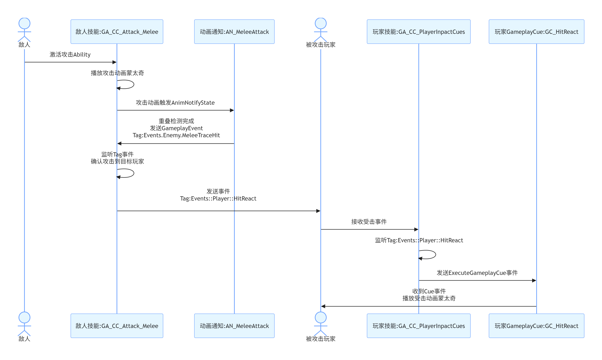

# CrashCourseGAS
UE5 快速GAS课程
课程中文标题：虚幻引擎5 Gameplay Ability System (GAS) 速成课程  
课程英文标题：Unreal Engine 5 Gameplay Ability System (GAS) Crash Course  
课程时长：16小时21分钟  

* FAB自行导入免费资源 ParagonBoris和ParagonMinions,并删除报错蓝图


# GAS笔记:

GA中实例化策略大部分建议选择`每个Actor实例化`这样这个GA里可以存储一些信息,比如连招记录等

> 如何控制能力必须播放完成才能再次触发?
可以在GA中 选择 高级->实例化策略->每个Actor实例化 并且不选中重新触发实例化能力

> 如何控制鼠标或者按键按住一直自动触发技能?可以在按键绑定的时候使用 ETriggerEvent::Triggered 上面又设置了必须等能力结束了才能重新触发,所以按住鼠标就可以一直触发了
>


## GAS 调试命令
```
ShowDebug AbilitySystem
```
PageUp/PageDown可以切换调试对象


## 如何在C++中定义原生 Tag?


``` c++
//Tags.h
#pragma once
#include "CoreMinimal.h"
#include "NativeGameplayTags.h"

namespace CCTags
{
	namespace CCAbilities
	{
		UE_DECLARE_GAMEPLAY_TAG_EXTERN(ActivateOnGiven);
		UE_DECLARE_GAMEPLAY_TAG_EXTERN(Primary);
	}
}
```

``` c++
//Tags.cpp
#include "GameplayTags/CCTags.h"

namespace CCTags
{
	namespace CCAbilities
	{
		UE_DEFINE_GAMEPLAY_TAG_COMMENT(ActivateOnGiven,"CCTags.CCAbilities.ActivateOnGiven","授予自动激活")
		UE_DEFINE_GAMEPLAY_TAG_COMMENT(Primary,"CCTags.CCAbilities.Primary","标签.主要能力")
	}
}


```

## 联网游戏如何在正确时机初始化ASC?
多人游戏中Player的ASC应该放在PlayerState中,非玩家控制的怪物ASC一般放到Character中

> Player 需要在PlayerCharacter类中`PossessedBy`与`OnRep_PlayerState`都进行初始化.
因为Player的ASC组件放在PlayerState中,所以Player的ASC初始化要考虑服务器和客户端都正确初始化.
- 服务端 PossessedBy函数只在服务器调用,并且此时PlayerState类已经初始化了,所以可以在PossessedBy中对ASC进行初始化
- 客户端 OnRep_PlayerState 客户端初始化ASC需要先得到ASC,因为ASC在PlayerState中,所以我们可以等待PlayerState同步到客户端再进行ASC的初始化


> Enemy 需要在`EnemyCharacter::BeginPlay`中进行初始化.
因为BeginPlay是在客户端/服务器端都执行,并且ASC组件就在Character上,所以这一个函数就可以正确在客户端/服务器初始化ASC

``` c++
//PlayerCharacter.cpp

void ACC_PlayerCharacter::PossessedBy(AController* NewController)
{
	Super::PossessedBy(NewController);
	
	//这个函数在服务器被调用的时候,我们可以确定 PlayerState和Pawn都被正确实例化了,所以这个时机可以
	//这个函数只在服务器调用,当这个pawn被控制了,可以初始化AbilitySystemComponent 拥有者和化身
	if (!IsValid(GetAbilitySystemComponent()) || !HasAuthority()) return;
	GetAbilitySystemComponent()->InitAbilityActorInfo(GetPlayerState(),this);

}

void ACC_PlayerCharacter::OnRep_PlayerState()
{
	Super::OnRep_PlayerState();

	//这个函数将在客户端正确初始化AbilitySystemComponent,因为这个时候客户端才实例化PlayerState和Pawn,
	//拥有这两个变量我们才能初始化AbilitySystemComponent
	if (!IsValid(GetAbilitySystemComponent())) return;
	GetAbilitySystemComponent()->InitAbilityActorInfo(GetPlayerState(),this);
}


```

## 如何制作初始自动授予技能?

- 1.我们在Character中增加自动授予能力数组
``` c++
// BaseCharacter.h
UPROPERTY(EditDefaultsOnly,Category = "CC|Abilities")
TArray<TSubclassOf<UGameplayAbility>> StartupAbilities;
```
- 2.编写自动授予函数
``` c++
// BaseCharacter.cpp
void ACC_BaseCharacter::GiveStartupAbilities()
{
	if (!IsValid(GetAbilitySystemComponent())) return;
	
	for (const auto& Ability: StartupAbilities)
	{
		FGameplayAbilitySpec AbilitySpec = FGameplayAbilitySpec(Ability);
		GetAbilitySystemComponent()->GiveAbility(AbilitySpec);
	}
}
```
- 3.Player/Enemy调用自动授予函数
	- Player情况下  在 PlayerCharacter::PossessedBy中执行自动授予能力
	- Enemy情况下 在EnemyCharacter::BeginPlay中执行自动授予能力
``` c++
//Player情况下  在 PlayerCharacter::PossessedBy中执行自动授予能力
void ACC_PlayerCharacter::PossessedBy(AController* NewController)
{
	Super::PossessedBy(NewController);
	
	//这个函数在服务器被调用的时候,我们可以确定 PlayerState和Pawn都被正确实例化了,所以这个时机可以
	//这个函数只在服务器调用,当这个pawn被控制了,可以初始化AbilitySystemComponent 拥有者和化身
	if (!IsValid(GetAbilitySystemComponent()) || !HasAuthority()) return;
	GetAbilitySystemComponent()->InitAbilityActorInfo(GetPlayerState(),this);

	//只在服务器授予能力就行,授予能力行为会自动进行网络同步
	GiveStartupAbilities();
}

// Enemy情况下 在EnemyCharacter::BeginPlay中执行自动授予能力
void ACC_EnemyCharacter::BeginPlay()
{
	Super::BeginPlay();

	//直接初始化
	if (!IsValid(AbilitySystemComponent))return;
	
	AbilitySystemComponent->InitAbilityActorInfo(this,this);

	
	if (!HasAuthority())return;
	//赋予能力只在服务器上执行
	GiveStartupAbilities();
}

```

## 如何制作初始自动授予技能的同时自动激活能力?
1.定义一个Tag用于识别哪些能力需要授予时自动激活

定义一个Tag 名称为`CCTags.CCAbilities.ActivateOnGiven`(名称随意)

2.编写激活函数
``` c++
//AbilitySystemComponent.cpp
void UCC_AbilitySystemComponent::HandleAutoActivatedAbility(const FGameplayAbilitySpec& AbilitySpec)
{
	if (!IsValid(AbilitySpec.Ability)) return;
	
	for (auto& Tag : AbilitySpec.Ability->GetAssetTags())
	{
		//判断是否包含这个标签,如果包含这个标签就激活这个技能
		if (Tag.MatchesTagExact(CCTags::CCAbilities::ActivateOnGiven))
		{
			TryActivateAbility(AbilitySpec.Handle);
			return;
		}
	}
}

```
3.调用激活函数,需要在`OnGiveAbility`与`OnRep_ActivateAbilities`都调用才能正确在网络中同步
``` c++
//AbilitySystemComponent.cpp
void UCC_AbilitySystemComponent::OnGiveAbility(FGameplayAbilitySpec& AbilitySpec)
{
	Super::OnGiveAbility(AbilitySpec);

	HandleAutoActivatedAbility(AbilitySpec);
}

void UCC_AbilitySystemComponent::OnRep_ActivateAbilities()
{
	Super::OnRep_ActivateAbilities();

	FScopedAbilityListLock ActiveScopeLock(*this);
	for (auto& AbilitySpec : GetActivatableAbilities())
	{
		HandleAutoActivatedAbility(AbilitySpec);
	}
}
```
4.将tag设置给GA

在蓝图中将Tag设置给AssetTag 变量
## 如何制作普通攻击技能GA 以及左右手攻击不同动画交替显示?

将GA的实例化策略改成 每Actor实例化,这样无论释放多少次技能,实际只存在一个GA实例.
这样的话我们就可以在GA中保存变量或者使用Flip节点来播放不同的动画蒙太奇来播放不同的连招动画

## 如何给一个Actor发送 GameplayEvent事件?

```c++
FGameplayEventData Payload;
Payload.Instigator = GetAvatarActorFromActorInfo();
UAbilitySystemBlueprintLibrary::SendGameplayEventToActor(actor,CCTags::Events::Enemy::HitReact,Payload);
```

# Attribute
## AttributeSet 创建一个血量 样板代码
```c++
//CC_AttributeSet.h
#pragma once

#include "CoreMinimal.h"
#include "AbilitySystemComponent.h"
#include "AttributeSet.h"
#include "CC_AttributeSet.generated.h"

#define ATTRIBUTE_ACCESSORS(ClassName, PropertyName) \
	GAMEPLAYATTRIBUTE_PROPERTY_GETTER(ClassName, PropertyName) \
	GAMEPLAYATTRIBUTE_VALUE_GETTER(PropertyName) \
	GAMEPLAYATTRIBUTE_VALUE_SETTER(PropertyName) \
	GAMEPLAYATTRIBUTE_VALUE_INITTER(PropertyName)

UCLASS()
class FASTGAS_API UCC_AttributeSet : public UAttributeSet
{
	GENERATED_BODY()
public:
	virtual void GetLifetimeReplicatedProps(TArray<FLifetimeProperty>& OutLifetimeProps) const override;

	UPROPERTY(BlueprintReadOnly,ReplicatedUsing=OnRep_Health)
	FGameplayAttributeData Health;

	UFUNCTION()
	void OnRep_Health(const FGameplayAttributeData OldValue);

	ATTRIBUTE_ACCESSORS(ThisClass,Health);
};
```
```c++
//CC_AttributeSet.cpp
#include "AbilitySystem/CC_AttributeSet.h"
#include "Net/UnrealNetwork.h"

void UCC_AttributeSet::GetLifetimeReplicatedProps(TArray<FLifetimeProperty>& OutLifetimeProps) const
{
	Super::GetLifetimeReplicatedProps(OutLifetimeProps);
	//网络复制
	DOREPLIFETIME_CONDITION_NOTIFY(ThisClass, Health, COND_None, REPNOTIFY_Always);
}

void UCC_AttributeSet::OnRep_Health(const FGameplayAttributeData OldValue)
{
	//本地预测修改属性
	GAMEPLAYATTRIBUTE_REPNOTIFY(ThisClass, Health, OldValue);
}
```

## c++如何使用增强输入绑定按键?
* 先准备 `UInputMappingContext`IMC和`UInputAction` IA
* 在`UEnhancedInputLocalPlayerSubsystem`中注册`InputSubsystem->AddMappingContext(Content,0);`IMC
* 在`UEnhancedInputComponent`中注册IA

``` c++
//CC_PlayerController.h

struct FInputActionValue;
class UInputAction;
class UInputMappingContext;

private:
	UPROPERTY(EditDefaultsOnly,Category="CC|Input")
	TArray<TObjectPtr<UInputMappingContext>> InputMappingContexts;
	
	UPROPERTY(EditDefaultsOnly,Category="CC|Input")
	TObjectPtr<UInputAction> JumpAction;
	
	UPROPERTY(EditDefaultsOnly,Category="CC|Input")
	TObjectPtr<UInputAction> MoveAction;

	void Jump();
	void StopJumping();
	void Move(const FInputActionValue& Value);
}
```

``` c++
//CC_PlayerController.cpp

#include "Player/CC_PlayerController.h"

#include "AbilitySystemComponent.h"
#include "AbilitySystemBlueprintLibrary.h"
#include "AbilitySystemInterface.h"
#include "EnhancedInputComponent.h"
#include "EnhancedInputSubsystems.h"
#include "InputMappingContext.h"
#include "GameFramework/Character.h"
#include "GameplayTags/CCTags.h"


void ACC_PlayerController::SetupInputComponent()
{
	Super::SetupInputComponent();
	UEnhancedInputLocalPlayerSubsystem* InputSubsystem = ULocalPlayer::GetSubsystem<UEnhancedInputLocalPlayerSubsystem>(GetLocalPlayer());
	if (!IsValid(InputSubsystem)) return;
	
	for (UInputMappingContext* Content:InputMappingContexts)
	{
		InputSubsystem->AddMappingContext(Content,0);
	}
	
	UEnhancedInputComponent* EnhancedInputComponent =  Cast<UEnhancedInputComponent>(InputComponent) ;
	if (!IsValid(EnhancedInputComponent)) return;

	EnhancedInputComponent->BindAction(JumpAction,ETriggerEvent::Started,this,&ThisClass::Jump);
	EnhancedInputComponent->BindAction(JumpAction,ETriggerEvent::Completed,this,&ThisClass::StopJumping);
	EnhancedInputComponent->BindAction(MoveAction,ETriggerEvent::Triggered,this,&ThisClass::Move);
}

void ACC_PlayerController::Jump()
{
	if (!IsValid(GetCharacter())) return;

	GetCharacter()->Jump();
}

void ACC_PlayerController::StopJumping()
{
	if (!IsValid(GetCharacter())) return;

	GetCharacter()->StopJumping();
}

void ACC_PlayerController::Move(const FInputActionValue& Value)
{
	if (!IsValid(GetPawn())) return;

	const FVector2d MovementVector = Value.Get<FVector2d>();

	const FRotator YawRotation(0.f,GetControlRotation().Yaw,0.f);
	const FVector ForwardDirection = FRotationMatrix(YawRotation).GetUnitAxis(EAxis::X);
	const FVector RightDirection = FRotationMatrix(YawRotation).GetUnitAxis(EAxis::Y);
	
	//这里需要注意 UE中X是前方向,但是增强输入系统的 Value 是按照 XYZ(左右/前后/上下)顺序的
	GetPawn()->AddMovementInput(ForwardDirection,MovementVector.Y);
	GetPawn()->AddMovementInput(RightDirection,MovementVector.X);
}

```

## 如何使用GE初始化AttributeSet?
目前看来这个办法并不好用,适合单机游戏,不太灵活

```c++
//BaseCharacter.h

	UPROPERTY(EditDefaultsOnly,Category = "CC|Effects")
	TSubclassOf<UGameplayEffect> InitializeAttributeEffect;

//BaseCharacter.cpp
void ACC_BaseCharacter::InitializeAttributes() const
{
	if (!IsValid(InitializeAttributeEffect)) return;
	
	FGameplayEffectContextHandle ContextHandle = GetAbilitySystemComponent()->MakeEffectContext();
	FGameplayEffectSpecHandle SpecHandle = GetAbilitySystemComponent()->MakeOutgoingSpec(InitializeAttributeEffect,1,ContextHandle);
	GetAbilitySystemComponent()->ApplyGameplayEffectSpecToSelf(*SpecHandle.Data.Get());
}


//记得在Character蓝图中给变量InitializeAttributeEffect赋值


//激活
//如果是Player(ASC 放在PlayerState中) 可以只在PossessedBy函数中调用InitializeAttributes,因为Effect是同步的,所以只在服务器调用即可
//如果是Enemy(ASC 放在Character中) 可以在BeginPlay函数中调用InitializeAttributes

```

# 如何监听一个Attribute变化

```C++
//通过asc 就可得到多播委托,然后就可以.AddLambda 或者bind了
CCAbilitySystemComponent->GetGameplayAttributeValueChangeDelegate(FGameplayAttribute)

```

## AttributeSet是怎么和AbilitySystemComponent关联起来的?

当两个变量在同一个actor上可以通过反射自动关联,注意必须有UPROPERTY()来使这个AttributeSet可以被反射发现

	UPROPERTY(VisibleAnywhere,Category = "CC|Ability")
	TObjectPtr<UAbilitySystemComponent> AbilitySystemComponent;

	UPROPERTY()
	TObjectPtr<UAttributeSet> AttributeSet;


## 如何将Attribute的数值与UIWidget绑定起来显示血量等数值?

我们需要在ASC正确初始化后进行属性绑定
[联网游戏如何在正确时机初始化ASC](#联网游戏如何在正确时机初始化ASC)

* 教程里思路:
	* 1.给Character增加一个组件,UWidgetComponent(用来在角色头顶显示UI的)
	* 2.创建UIWidget 显示血量什么的
	* 3.在UWidgetComponent中绑定 Attribute 变化委托


* 如何知道ASC已经初始化了
增加OnASCInitialized 动态多播委托,用来通知ASC已经初始化完成了,我们绑定需要在ASC初始化以后进行
```c++
//Player的情况
//PlayerCharacter.cpp
//此函数只在服务器调用
void ACC_PlayerCharacter::PossessedBy(AController* NewController)
{
	if (!IsValid(GetAbilitySystemComponent()) || !HasAuthority()) return;
	GetAbilitySystemComponent()->InitAbilityActorInfo(GetPlayerState(),this);
	OnASCInitialized.Broadcast(GetAbilitySystemComponent(),GetAttributeSet());

}

void ACC_PlayerCharacter::OnRep_PlayerState()
{
	if (!IsValid(GetAbilitySystemComponent())) return;
	GetAbilitySystemComponent()->InitAbilityActorInfo(GetPlayerState(),this);
	OnASCInitialized.Broadcast(GetAbilitySystemComponent(),GetAttributeSet());
}

//Enemy的情况
//EnemyCharacter.cpp
void ACC_EnemyCharacter::BeginPlay()
{
	if (!IsValid(AbilitySystemComponent))return;
	AbilitySystemComponent->InitAbilityActorInfo(this,this);
	OnASCInitialized.Broadcast(GetAbilitySystemComponent(),GetAttributeSet());
}

```
* 正确等待ASC初始化并绑定 (我们在WidgetComponent组件中进行绑定(此组件是放在Character中的))

```c++
//CC_WidgetComponent.cpp
void UCC_WidgetComponent::BeginPlay()
{
	Super::BeginPlay();
	//我们先拿一次看看能不能拿到ASC组件,如果能拿到说明ASC已经初始化了,我们可以进行绑定了
	InitAbilitySystemData();

	//如果没拿到ASC组件,说明可能是在客户端,我们需要等ASC初始化才能开始绑定
	//所以在这监听ASC初始化
	if (!CCAttributeSet.IsValid() || !CCAbilitySystemComponent.IsValid())
	{
		CCCharacter->OnASCInitialized.AddDynamic(this, &UCC_WidgetComponent::OnASCInitialized);
	}
}

void UCC_WidgetComponent::InitAbilitySystemData()
{
	CCCharacter = Cast<ACC_BaseCharacter>(GetOwner());
	CCAttributeSet = Cast<UCC_AttributeSet>(CCCharacter->GetAttributeSet());
	CCAbilitySystemComponent = Cast<UCC_AbilitySystemComponent>(CCCharacter->GetAbilitySystemComponent());
	//BeginPlay直接初始化完成,那就开始绑定
	if (CCAttributeSet.IsValid())
	{
		OnAttributeInitialized();
	}
}

void UCC_WidgetComponent::OnASCInitialized(UAbilitySystemComponent* ASC, UAttributeSet* AttributeSet)
{
	CCAttributeSet = Cast<UCC_AttributeSet>(AttributeSet);
	CCAbilitySystemComponent = Cast<UCC_AbilitySystemComponent>(ASC);
	//BeginPlay没初始化成功,那就等待初始化成功事件,然后开始绑定
	if (CCAttributeSet.IsValid())
	{
		OnAttributeInitialized();
	}
}
//绑定函数


void UCC_WidgetComponent::OnAttributeInitialized()
{
	//绑定 attribute
	//我们可以把ASC发送给UI组件,让UI组件自己绑定,或者在此拿到我们自定义的UIWidget进行绑定
	
	//GetUserWidgetObject()函数可以拿到当前组件上显示的UIWidget
	//注意 WidgetTree->ForEachWidget 并不包含自身

	GetUserWidgetObject()->WidgetTree->ForEachWidget([this,&pair](UWidget* ChildWidget)
	{
		//我们可以在此做类型转换,判断此UIWidget是不是我们用来显示Attribute的
		if(是我们用来显示Attribute的UI)
		{
			CCAbilitySystemComponent->GetGameplayAttributeValueChangeDelegate(FGameplayAttribute)
			.AddLambda
			或者
			Bind
			.AddLambda([this, &Pair, CCAttributeWidget](const FOnAttributeChangeData& Data)
			{
				Data.NewValue就是新值
			});
		}
	});
	
}
```

## 如何给技能升级?

```c++
//CC_AbilitySystemComponent.cpp
//修改等级然后设置脏,就更新了
void UCC_AbilitySystemComponent::SetAbilityLevel(TSubclassOf<UGameplayAbility> Ability, int32 Level)
{
	//只能在服务器更改等级
	if (IsValid(GetAvatarActor()) && !GetAvatarActor()->HasAuthority()) return;

	if (FGameplayAbilitySpec* Spec = FindAbilitySpecFromClass(Ability))
	{
		Spec->Level = Level;
		MarkAbilitySpecDirty(*Spec);
	}
}
```
注意如果你想调用`SetAbilityLevel`函数记得在服务器调用,可以使用 Run on Server RPC 来实现
然后可以在 GA中使用`GetAbilityLevel`获取技能等级,后续可以使用此技能等级传递给GE/根据技能等级实现各种效果之类的
也可以删除技能,重新赋予技能,在赋予技能的时候传入等级参数来给技能升级


## c++如何编写复制变量?

- 给变量增加`Replicated`
```c++
//.h
	UPROPERTY(blueprintreadonly, meta = (AllowPrivateAccess = "true"),Replicated)
	bool bAlive = true;
```
- override `GetLifetimeReplicatedProps` 函数
```c++
//.h
public:
	virtual void GetLifetimeReplicatedProps(TArray<FLifetimeProperty>& OutLifetimeProps) const override;
```

- 使用宏`DOREPLIFETIME`将变量添加到`GetLifetimeReplicatedProps`函数中
```c++
//.cpp
#include "Net/UnrealNetwork.h"

void ACC_BaseCharacter::GetLifetimeReplicatedProps(TArray<FLifetimeProperty>& OutLifetimeProps) const
{
	Super::GetLifetimeReplicatedProps(OutLifetimeProps);
	DOREPLIFETIME(ThisClass, bAlive);
}
```

## c++如何编写蓝图异步节点? 在Ability中分为 AbilityTask和AbilityAsync,前者跟随GA生命周期,只能在GA中用,后者需要手动关闭可以在任何地方用

- 需要继承类`UBlueprintAsyncActionBase`
- 定义一个或多个动态多播委托(异步输出引脚能用到)`DECLARE_DYNAMIC_MULTICAST_DELEGATE_ThreeParams(FOnAttributeChanged, FGameplayAttribute, Attribute, float, NewValue, float, OldValue);`
- 标记动态多播委托变量为输出引脚 需要使用 BlueprintAssignable标记
```
	UPROPERTY(BlueprintAssignable) FOnAttributeChanged OnAttributeChanged;
```
- 创建静态工厂类函数,给蓝图创建此异步任务实例 
```
	UFUNCTION(BlueprintCallable,meta = (BlueprintInternalUseOnly = "true"))
	static UCC_AttributeChangeTask* ListenForAttributeChange(UAbilitySystemComponent* AbilitySystemComponent,FGameplayAttribute Attribute);

```
- 创建EndTask函数`void EndTask();`需要调用清理函数
```	
//此函数可以暴露给蓝图手动停止,也可以异步节点内自动调用结束,自动调用结束就不用手动调用结束了
void UCC_AttributeChangeTask::EndTask()
{
	if (ASC.IsValid())
	{
		ASC->GetGameplayAttributeValueChangeDelegate(AttributeToListenFor).RemoveAll(this);
	}

	SetReadyToDestroy();
	MarkAsGarbage();
}
```

- 完整示例
```
//CC_AttributeChangeTask.h

#pragma once

#include "CoreMinimal.h"
#include "AttributeSet.h"
#include "Kismet/BlueprintAsyncActionBase.h"
#include "CC_AttributeChangeTask.generated.h"

struct FOnAttributeChangeData;
DECLARE_DYNAMIC_MULTICAST_DELEGATE_ThreeParams(FOnAttributeChanged, FGameplayAttribute, Attribute, float, NewValue, float, OldValue);

//添加meta=(ExposedAsyncProxy = AsyncTask) 可以在节点返回实例引用 然后在合适时机调用EndTask
UCLASS(Blueprintable,meta = (ExposedAsyncProxy = "AsyncTask"))
class FASTGAS_API UCC_AttributeChangeTask : public UBlueprintAsyncActionBase
{
	GENERATED_BODY()

public:

	//异步输出引脚 使用 UPROPERTY(BlueprintAssignable) 标记 可以有多个动态多播委托变量,每个变量对应一个输出引脚
	UPROPERTY(BlueprintAssignable)
	FOnAttributeChanged OnAttributeChanged;

	//蓝图里创建异步蓝图节点的函数,使用 (BlueprintInternalUseOnly = "true") 标记
	UFUNCTION(BlueprintCallable,meta = (BlueprintInternalUseOnly = "true"))
	static UCC_AttributeChangeTask* ListenForAttributeChange(UAbilitySystemComponent* AbilitySystemComponent,FGameplayAttribute Attribute);


	//清理函数,此例子里需要手动在蓝图里调用否则不会清理此实例
	UFUNCTION(BlueprintCallable)
	void EndTask();

	TWeakObjectPtr<UAbilitySystemComponent> ASC;
	FGameplayAttribute AttributeToListenFor;

	void AttributeChanged(const FOnAttributeChangeData& Data);
};

```
```
//CC_AttributeChangeTask.cpp

#include "Tasks/CC_AttributeChangeTask.h"

#include "AbilitySystemComponent.h"

UCC_AttributeChangeTask* UCC_AttributeChangeTask::ListenForAttributeChange(UAbilitySystemComponent* AbilitySystemComponent, FGameplayAttribute Attribute)
{
	if (!IsValid(AbilitySystemComponent))
	{
		return nullptr;
	}
	
	UCC_AttributeChangeTask* WaitForAttributeChangeTask = NewObject<UCC_AttributeChangeTask>();
	WaitForAttributeChangeTask->ASC = AbilitySystemComponent;
	WaitForAttributeChangeTask->AttributeToListenFor = Attribute;
	
	AbilitySystemComponent->GetGameplayAttributeValueChangeDelegate(Attribute).AddUObject(WaitForAttributeChangeTask,&UCC_AttributeChangeTask::AttributeChanged);

	return WaitForAttributeChangeTask;
	
}

void UCC_AttributeChangeTask::EndTask()
{
	if (ASC.IsValid())
	{
		ASC->GetGameplayAttributeValueChangeDelegate(AttributeToListenFor).RemoveAll(this);
	}

	SetReadyToDestroy();
	MarkAsGarbage();
}

void UCC_AttributeChangeTask::AttributeChanged(const FOnAttributeChangeData& Data)
{
	OnAttributeChanged.Broadcast(Data.Attribute,Data.NewValue,Data.OldValue);
}

```

## 如何知道我杀了哪个敌人,或者我对敌人造成了多少伤害,比如击杀小兵增加经验?

- 我们可以在`AttributeSet`函数 `PostGameplayEffectExecute`里做血量变化监听, 通过`GameplayEvent`来通知回击杀者

* 定义一个Tag `CCTags::Events::KillScored` 参照上面定义tag部分
* 构造并发送事件
``` c++
//CC_AttributeSet.cpp
void UCC_AttributeSet::PostGameplayEffectExecute(const FGameplayEffectModCallbackData& Data)
{
	Super::PostGameplayEffectExecute(Data);

	//这里我们判断如果变化的属性是血量,并且当前血量已经<=0就发送事件,如果想统计伤害,我们也可以只判断是否是血量就可以
	if (Data.EvaluatedData.Attribute == GetHealthAttribute() && GetHealth() <= 0.f)
	{
		FGameplayEventData Payload;
		//这个Data.Target.GetAvatarActor();就是被扣血的角色
		Payload.Target = Data.Target.GetAvatarActor();
		//Data.EffectSpec.GetEffectContext().GetInstigator() 就是发出伤害的玩家,我们把这个事件发送回给他
		UAbilitySystemBlueprintLibrary::SendGameplayEventToActor(Data.EffectSpec.GetEffectContext().GetInstigator(), CCTags::Events::KillScored,Payload);
	}
}
```
* 监听事件 我们可以在击杀者的GA中使用`WaitGameplayEvent`节点来监听这个 `CCTags::Events::KillScored`tag,从Payload中拿到击杀了谁


## AI敌人 子弹/投射物制作思路

1. 制作一个 `GA_Attack`  需要网络执行策略`NetExecutionPolicy`为`SercerOnly` 因为SpawnActor函数应该在服务器调用(或者调用SpawnActor前加`HasAuthority`判断)
2. 制作一个 `Projectile Actor` 弹丸Actor的网络复制变量应该为`Replicates = True` 这样在服务器Spawn这个Actor的时候,所有客户端都会Spawn这个Actor,一般也可以在这里配置`Initial Life Span`让子弹生成几秒不管打没达到敌人都消失
3. 制作一个 `GE_Projectile_Damage` 在`Modifiers->Modifier Magnitude->Manitude Calculation Type = Set By Caller`然后给Set by Caller选择一个tag`Set By Caller Magnitude->Data Tag`
4. `GA_Attack` 可以播放攻击蒙太奇动画,同时在服务器SpawnActor(Projectile Actor) 同时可以传入`伤害数值`(Projectile Actor 的 Damage变量可以选择在生成时暴露引脚)
5. `Projectile Actor` 与其他人重叠时应用伤害
``` c++
//CC_Projectile.cpp

//重叠时
void ACC_Projectile::NotifyActorBeginOverlap(AActor* OtherActor)
{
	Super::NotifyActorBeginOverlap(OtherActor);
	//需要在服务器应用GE
	if (!HasAuthority()) return;
	
	//一些判断
	ACC_PlayerCharacter* PlayerCharacter = Cast<ACC_PlayerCharacter>(OtherActor);
	if (!PlayerCharacter) return;
	if (!PlayerCharacter->IsAlive()) return;
	UAbilitySystemComponent* AbilitySystemComponent = PlayerCharacter->GetAbilitySystemComponent();
	if (!AbilitySystemComponent) return;
	if (!IsValid(DamageEffect)) return;

	//构造GE
	FGameplayEffectContextHandle EffectContextHandle = AbilitySystemComponent->MakeEffectContext();
	FGameplayEffectSpecHandle EffectSpecHandle = AbilitySystemComponent->MakeOutgoingSpec(DamageEffect,1,EffectContextHandle);
	//添加Set By Caller 数据
	UAbilitySystemBlueprintLibrary::AssignTagSetByCallerMagnitude(EffectSpecHandle,CCTags::SetByCaller::Projectile,-Damage);
	AbilitySystemComponent->ApplyGameplayEffectSpecToSelf(*EffectSpecHandle.Data.Get());

	//击中后销毁子弹自己(注意考虑子弹没击中敌人过几秒后也要自动销毁/或者子弹跑一段距离也销毁射程限制)
	Destroy();
}

```

## 近战敌人攻击判定如何制作?

创建一个 `AnimNotifyState` 动画通知添加到动画蒙太奇中的通知中(小技巧,拖拽NotifyState的时候可以安装Shift键可以同时看到动画帧)
然后选择一段范围,然后重写 `AnimNotifyState` `ReceivedNotifyTick`函数,就能在一段动画范围内接收动画通知了
然后在NotifyTick函数内可以通过MeshComp函数获取动画插槽,拿到武器的攻击点,进行重叠追踪了

收到重叠HitResult 后怎么把HitResult使用SendGamePlayEvent 发给对应Ability呢,可以使用 ASC的MakeEffectContext函数创建一个 EffectContext,调用EffectContext->AddHitResult
将EffectContext传递给 SendGamePlayEvent.Payload.ContextHandle参数


## 二级或多级Attribute数值联动变化如何制作? 比如力量/或者智慧属性变化了,如何自动更新攻击力属性?

### 什么是二级或多级属性?

比如我们游戏有基础属性`力量`与`敏捷` 此时我们设定为`攻击力=力量+敏捷`,我们再创建一个`攻击力`属性
如果力量/或者智慧属性变化了,如何自动更新攻击力属性?

```
或者我们有更复杂的多级属性

第一层（基础属性）          第二层（派生属性）           第三层（最终属性）
┌──────────┐
│ Strength │──MMC──→ ┌──────────────┐
│  力量    │         │ AttackPower  │──MMC──→ ┌────────────────┐
└──────────┘    ┌──→ │  攻击力      │         │ FinalDamage    │
┌──────────┐    │    └──────────────┘    ┌──→ │  最终伤害加成   │
│ Agility  │──MMC                        │    └────────────────┘
│  敏捷    │──MMC──→ ┌──────────────┐    │
└──────────┘         │ CritRate     │──MMC
┌──────────┐    ┌──→ │  暴击率      │
│ Luck     │──MMC    └──────────────┘
│  幸运    │
└──────────┘──MMC──→ ┌──────────────┐
                     │ DropRate     │
                     │  掉落率      │
                     └──────────────┘

```

### 我们可以使用MMC(GameplayModMagnitudeCalculation)来实现

1. 准备一个MMC,MMC的作用很简单,选择要捕获(依赖)的Attribute(以这里为例选择力量与敏捷),重写计算函数计算数值
2. 准备一个GE,这种工作的GE要设置为`Infinite`,GE的Modifiers->Attribute要选择要影响的属性(以这里为例选择攻击力属性)
3. 把MMC配置给GE
4. 把GE应用到玩家或者敌人身上
5. 此时我们修改力量或者敏捷属性,攻击力属性就会通过这个GE与MMC自动更新数值

### 原理

每个Attribute都有Aggregator（聚合器）,当我们的MMC捕获其他属性的时候会添加依赖,当基础属性数值变化就会自动触发MMC重算派生属性数值

### 如果循环依赖了怎么办? 避免循环依赖!
比如LOL中吸血鬼的被动技能`每40生命值加成给予吸血鬼1法术强度 每1法术强度给予弗拉基米尔1.4生命值`


此时使用上面的MMC机制后会造成,法强->血量->法强->血量.....属性循环依赖导致无限循环计算
此时我们可以将血量和法强分别拆成两个Attribute
>血量:BaseHP与HP

>法强:BaseAP与AP

我们让HP依赖BaseHP与BaseAP,AP依赖BaseAP与BaseHP,达到法强增加血量,血量增加法强的目的,此时当我们BaseHP/BaseAP发生变化,就不会造成循环依赖了`MMC_HP 和 MMC_AP 都只依赖基础层，彼此之间没有任何关联`

### 如果GE 对属性的修改为Add,那么基础属性变化后会触发二级属性重算,此时会給二级属性累加么?
Attribute的值分为BaseValue与CurrentValue,重算时使用的是BaseValue重算,BaseValue只有立即生效的GE类型才会修改Base值


# TODO:吸血功能怎么计算数值?

# TODO:两种自定义计算属性类区别,适用范围


# 设置GameplayCue 搜索路径
如果Cue目录为 CrashCourseGAS\Content\CC\AbilitySystem\GameplayCues,就按下面的配置
``` ini
# DefaultGame.ini
[/Script/GameplayAbilities.AbilitySystemGlobals]
+GameplayCueNotifyPaths=/Game/CC/AbilitySystem/GameplayCues
```

# 敌人近战攻击到玩家播放受击蒙太奇调用路径

1. 敌人技能:GA_CC_Attack_Melee 激活攻击Ability,然后播放攻击动画蒙太奇
2. 敌人技能动画通知事件:AN_MeleeAttack 攻击动画中触发 AnimNotifyState进行重叠检测 `SendGameplayEventToActor Tag:Events.Enemy.MeleeTraceHit`给敌人玩家自身
3. 敌人技能:GA_CC_Attack_Melee 监听Tag事件`Tag:Events.Enemy.MeleeTraceHit`知道了此技能攻击到了哪个玩家
4. 敌人技能:GA_CC_Attack_Melee 发送事件给被攻击到的玩家 `Tag:Events::Player::HitReact`
5. 玩家技能:GA_CC_PlayerInpactCues 监听事件`Tag:Events::Player::HitReact` 知道了自己被攻击了 发送`ExecuteGameplayCue`事件
6. 玩家GameplayCue:GC_HitReact 收到Cue事件,播放受击动画蒙太奇

